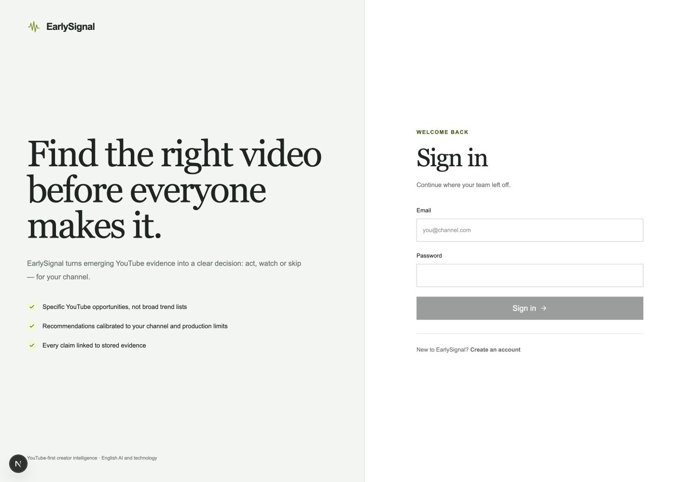
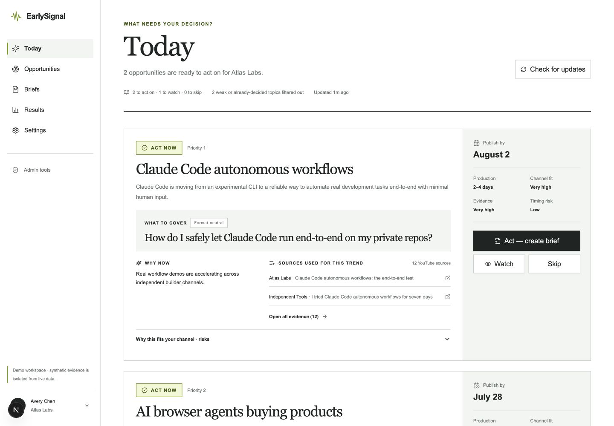
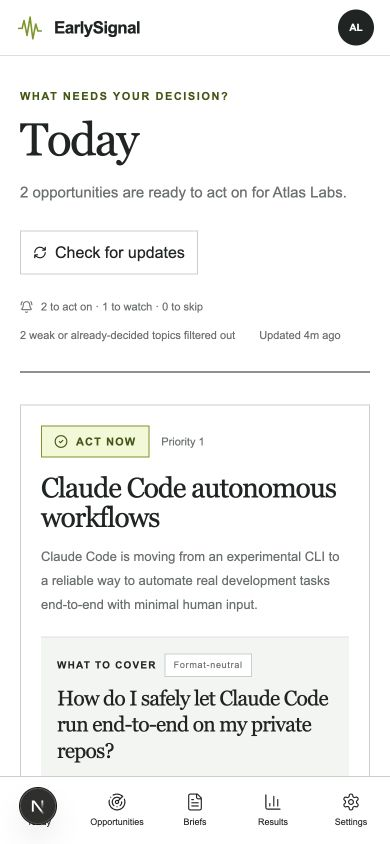
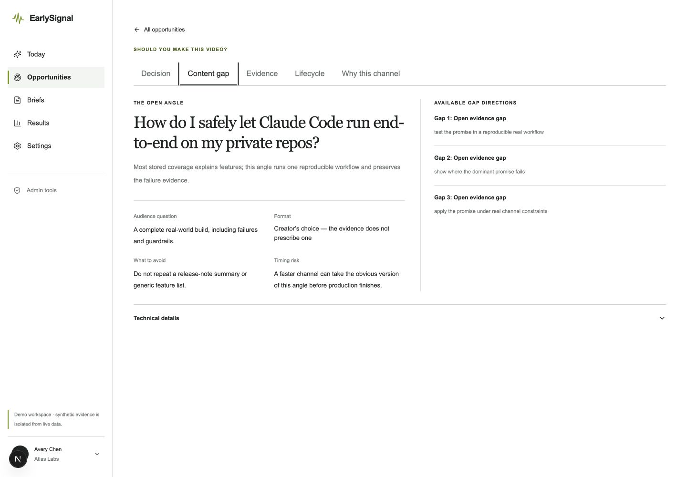
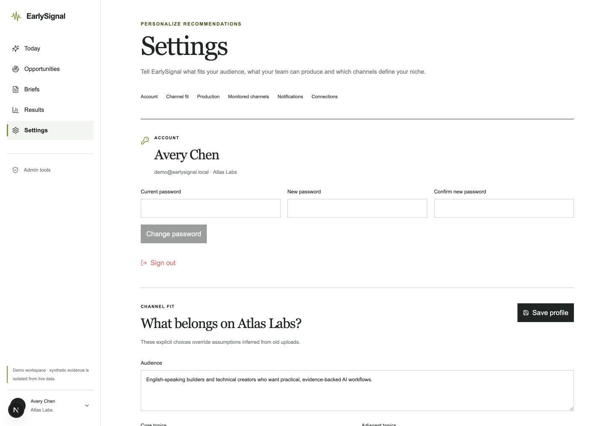
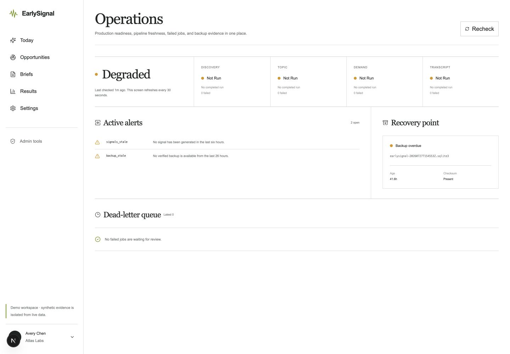
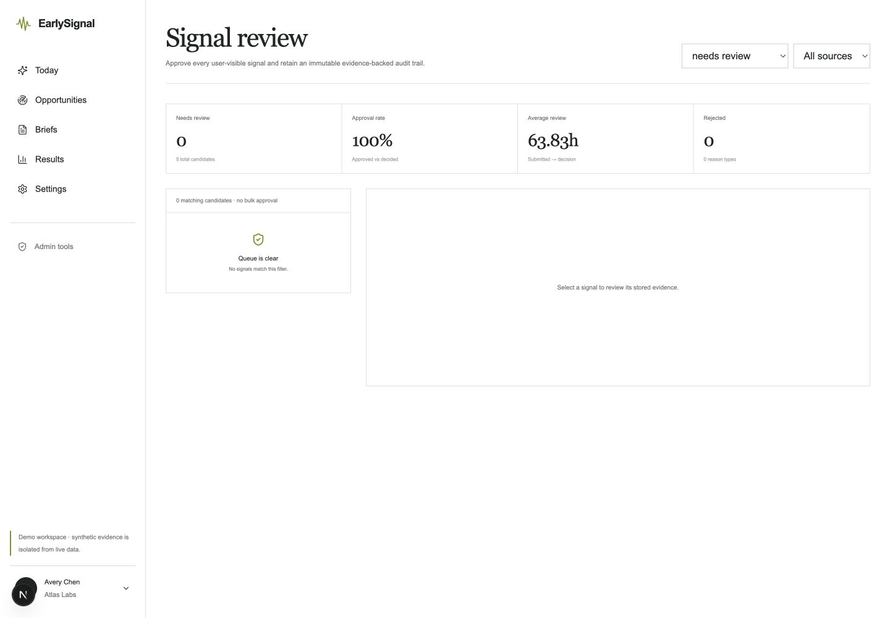
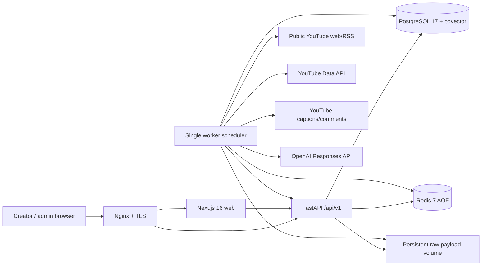
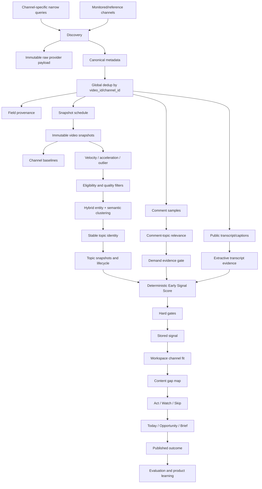
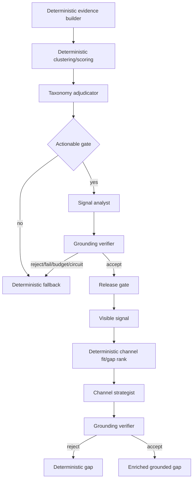

# EarlySignal — полный пакет проекта для независимого аудита

**Версия документа:** 1.0  
**Дата фиксации:** 29 июля 2026 года  
**Production:** [https://esignal.tech](https://esignal.tech)  
**Репозиторий:** монорепозиторий EarlySignal  
**Назначение:** продуктовый, UX, data/ML, backend, security и operations-аудит

---

## 0. Как читать этот документ

Это не vision-документ и не перечень запланированных функций. Здесь разделены:

- фактически работающий пользовательский продукт;
- текущая production-архитектура;
- детерминированная аналитика и LLM-слой;
- изолированный demo-контур;
- известные ограничения и незакрытые риски;
- вопросы, на которые должен ответить независимый аудитор.

Скриншоты сняты 29 июля 2026 года со свежего локального demo-стенда из текущего
кода. Они показывают реальный UI и реальные состояния приложения, но
синтетические evidence и метрики. Production-цифры в разделе 18 получены
отдельно, read-only, с production-сервера.

### Статусы

| Маркер             | Значение                                                                |
| ------------------ | ----------------------------------------------------------------------- |
| **Работает**       | Реализовано, покрыто API/UI и используется в текущем приложении         |
| **Feature flag**   | Реализовано, может быть включено или отключено без отката кода          |
| **Ограничено**     | Работает, но требует private-beta контроля или дополнительной валидации |
| **Не реализовано** | Не входит в текущую работающую систему                                  |

---

## Содержание

1. [Executive summary](#1-executive-summary)
2. [Продуктовая граница и роли](#2-продуктовая-граница)
3. [Пользовательский путь и все основные экраны](#4-пользовательский-путь-и-текущее-ux-состояние)
4. [Admin-контур](#5-admin-контур)
5. [Архитектура и production topology](#6-системная-архитектура)
6. [Data pipeline, scoring, channel fit и LLM](#8-полный-data-pipeline)
7. [Данные, API, jobs и production snapshot](#17-модель-данных)
8. [Security, testing и observability](#22-security-и-privacy)
9. [UX, продуктовые и технические ограничения](#25-ux-аудит-текущего-интерфейса)
10. [Moat и вопросы аудитору](#27-что-формирует-moat)
11. [Карта репозитория и запуск](#30-карта-репозитория)
12. [Итоговая оценка](#33-итоговая-оценка)

---

## 1. Executive summary

EarlySignal — evidence-first сервис для YouTube-креаторов в англоязычной нише
AI/technology. Сервис отвечает не на вопрос «что сейчас популярно вообще», а на
более конкретный:

> Какое видео имеет смысл сделать этому каналу сейчас, почему тема растёт, какой
> незакрытый вопрос можно занять и на каких сохранённых источниках основан вывод?

Текущий пользовательский цикл:

```text
registration
→ paste YouTube channel
→ automatic channel profile and discovery plan
→ Today: Act / Watch / Skip
→ inspect direct YouTube evidence and content gap
→ create producer brief
→ mark production
→ associate published video
→ compare result with channel baseline
```

Ключевое архитектурное решение: **LLM не рассчитывает трендовый score и не
выбирает evidence**. Источники, исторические метрики, дедупликация, clustering,
scores, lifecycle, channel fit и release gates принадлежат приложению. LLM
получает bounded evidence packet, возвращает строгий JSON, проходит отдельный
grounding audit и при любой ошибке откатывается к deterministic fallback.

### Что уже является полноценным

- регистрация, login, server-side sessions и защищённый production;
- onboarding одним YouTube URL/handle;
- YouTube discovery, metadata, comments и transcripts через provider layer;
- immutable raw payloads, field provenance и исторические snapshots;
- channel-relative velocity/outlier features;
- конкретные микро-темы, lifecycle и прозрачный Early Signal Score;
- channel fit, production feasibility и format-neutral content gaps;
- Today, Opportunities, Evidence, Briefs, Results и Settings;
- OpenAI evidence-decision graph с обязательным grounding audit;
- provider health, budgets, circuits, operations и review UI;
- Docker production topology с PostgreSQL/pgvector и Redis;
- deterministic demo-контур и полный E2E пользовательского цикла.

### Главный незакрытый вопрос

Система уже технически сложнее обычного «списка трендов», но её moat и
коммерческая ценность ещё должны быть доказаны реальными creator outcomes:

- действительно ли конкретные opportunities полезнее редакторской интуиции;
- хватает ли разнообразия тем для каждого канала;
- насколько рано сервис находит темы;
- сколько рекомендаций превращается в brief, публикацию и результат выше
  baseline;
- не создаёт ли сложная evidence-архитектура ложное ощущение точности.

---

## 2. Продуктовая граница

### In scope

- только YouTube;
- только англоязычный AI/technology vertical;
- публичный discovery и публичные данные каналов/роликов;
- optional read-only YouTube Analytics через OAuth;
- конкретные topic opportunities;
- Act / Watch / Skip;
- evidence-linked brief;
- outcome association и channel-relative performance;
- admin/provider/review/evaluation контур;
- deterministic и evidence-grounded LLM enrichment.

### Out of scope

- TikTok, Instagram, X, Reddit как полноценные discovery-провайдеры;
- генерация полного сценария;
- автоматическая публикация;
- автоматическое управление YouTube-каналом;
- хранение полных видео;
- login-only scraping, CAPTCHA solving, fingerprint spoofing;
- billing и subscriptions;
- публичный marketplace трендов;
- гарантии причинности между рекомендацией и результатом.

Reddit, Hacker News, Google Trends и другие внешние источники могут стать
cross-source confirmation layer, но не должны подменять основной YouTube
evidence graph без отдельного provenance-контракта.

---

## 3. Целевая аудитория и роли

### Основной пользователь

YouTube-креатор или небольшая production-команда, которая:

- регулярно выпускает AI/technology контент;
- не хочет просматривать десятки каналов вручную;
- хочет раньше видеть конкретные возможности;
- не принимает «viral score» без источников;
- ограничена сроками производства и тематикой своего канала.

### Роли в системе

| Роль                       | Права и задачи                                            |
| -------------------------- | --------------------------------------------------------- |
| Creator / workspace member | Today, opportunities, evidence, briefs, results           |
| Workspace owner            | Профиль канала, production envelope, connections, account |
| Admin / operator           | Providers, ingestion, operations, query expansion         |
| Reviewer                   | Approve/reject/split/merge live signal с audit trail      |
| Evaluation specialist      | Разметка taxonomy, false merge, evidence и usefulness     |

---

## 4. Пользовательский путь и текущее UX-состояние

### 4.1 Login и registration



**Что работает**

- email/password registration;
- login и logout;
- server-side сессия в HttpOnly cookie;
- rate limiting неудачных login-попыток;
- PBKDF2 password hashing с настраиваемым количеством итераций;
- смена пароля из Settings;
- автоматическое создание первого workspace при регистрации.

**Текущее состояние UX:** здоровое. Пользователь понимает value proposition,
видит поля входа и переход к регистрации.

**Ограничения:** нет email verification, password reset и recovery flow.

---

### 4.2 Onboarding: один YouTube-канал


Пользователь вставляет:

- URL канала;
- `youtube.com/@handle`;
- `@handle`;
- canonical channel URL.

Backend:

1. разрешает URL/handle в canonical `channel_id`;
2. загружает публичную историю канала;
3. строит channel profile;
4. определяет core и adjacent topics;
5. оценивает обычные форматы и production envelope;
6. подбирает reference channels;
7. формирует узкие channel-specific discovery queries;
8. создаёт первый digest/opportunity set.

**Текущее состояние UX:** работает и существенно проще старого трёхшагового
wizard. Дополнительная настройка не требуется до первого результата.

**Риск для проверки:** нужно проверить качество автоматического профиля на
разных типах каналов: новости, tutorials, business commentary, reviews,
research и entertainment.

---

### 4.3 Today: очередь решений



Today показывает не общий feed, а максимум несколько решений:

- **Act** — достаточно momentum, fit, evidence и времени;
- **Watch** — тема перспективна, но доказательств или timing пока недостаточно;
- **Skip** — слабый fit, поздний lifecycle, высокая fragility или
  production-window mismatch.

Карточка содержит:

- нейтральное название микро-тренда;
- краткий thesis;
- format-neutral вопрос «What to cover»;
- why now;
- две прямые ссылки на YouTube;
- ссылку на полный evidence set;
- publish-by;
- production time;
- channel fit;
- evidence strength;
- timing risk;
- Act / Watch / Skip;
- раскрываемые channel-fit rationale и main risk.

**Текущее состояние UX:** основной decision surface работает, карточка
компактна и помещает главное решение в один desktop viewport.

**Риск для проверки:** достаточно ли понятна разница между trend name, thesis,
content gap и фактической идеей ролика.

---

### 4.4 Today на mobile



**Что подтверждено**

- responsive reflow при ширине 390 px;
- горизонтального overflow нет;
- bottom navigation сохраняет основные разделы;
- главная идея видна до evidence и технических деталей;
- действия остаются доступны в карточке/детальном экране.

**Ограничение аудита:** скриншот не доказывает полную WCAG-доступность,
screen-reader compatibility и keyboard-only navigation.

---

### 4.5 Opportunities: библиотека


Отличие от Today:

- Today — ограниченная очередь актуальных решений;
- Opportunities — более широкая библиотека текущих Act/Watch/Skip;
- есть фильтр по рекомендации;
- evidence доступен прямо из карточки;
- пользователь не обязан открывать raw score.

**Текущее состояние UX:** здоровое. Иерархия совпадает с Today.

**Риск:** библиотека пока не предлагает дополнительные способы группировки:
topic lane, lifecycle, production effort, freshness или already-covered state.

---

### 4.6 Opportunity detail: Evidence


Evidence screen показывает:

- все сохранённые YouTube-видео;
- прямую source-ссылку;
- канал и возраст публикации;
- роль evidence: driver, amplifier, supporting;
- views и transcript status;
- transcript excerpts;
- audience-demand evidence;
- технические детали в закрытом по умолчанию блоке.

Пользовательская claim должна разрешаться в сохранённый source ID. Приложение
не должно создавать ссылку на несуществующий evidence item.

**Текущее состояние UX:** сильный trust layer; источник доступен в один клик.

**Риск:** длинный evidence list требует лучшей визуальной группировки,
например по driver/amplifier/supporting и по независимым каналам.

---

### 4.7 Opportunity detail: Content gap



Content gap — это не автоматически выбранный формат ролика. Он описывает:

- незакрытый вопрос;
- audience promise;
- почему существующие видео его не закрывают;
- что не стоит повторять;
- timing risk;
- несколько допустимых gap directions.

Формат остаётся выбором автора. Это защищает output от bias в сторону
«tutorial», «review», «challenge» или другого формата, если evidence не
предписывает его.

**Текущее состояние UX:** логика понятна и отделена от evidence.

**Риск:** одинаковая формулировка нескольких gap cards в fallback-режиме может
выглядеть как дублирование и снижать доверие.

---

### 4.8 Briefs


Brief создаётся только после `Act` и включает:

- video opportunity;
- why now;
- open content gap;
- production window;
- suggested structure;
- hook directions;
- title/thumbnail directions;
- claims allowed / claims to avoid;
- main mismatch risk;
- direct link обратно к opportunity;
- Copy, Share link и Markdown export;
- production status.

Сервис намеренно не генерирует полный сценарий. Brief — evidence-linked
handoff для автора или продюсера.

**Текущее состояние UX:** рабочий одностраничный handoff.

**Риск:** нужно проверить, не воспринимаются ли suggested structure и hook
directions как новый скрытый format bias.

---

### 4.9 Results


Results связывает опубликованное видео с opportunity/brief:

- предлагает вероятную association;
- пользователь подтверждает или отклоняет связь;
- показывает 24h и 7d performance;
- сравнивает результат с нормой конкретного канала;
- не утверждает причинность.

**Текущее состояние UX:** полезная основа learning loop.

**Риск:** до достаточного числа реальных outcomes этот раздел не доказывает
predictive power продукта.

---

### 4.10 Settings



Разделы:

- Account;
- Channel fit;
- Production;
- Monitored channels;
- Notifications;
- Connections.

Пользователь может исправить автоматически выведенные:

- audience;
- core/adjacent/excluded topics;
- formats;
- brand constraints;
- production duration;
- production effort;
- monitored channels.

Optional YouTube OAuth использует read-only analytics scopes и хранит refresh
token в зашифрованном виде.

**Текущее состояние UX:** функционально полно для private beta.

**Риск:** экран длинный; tabs/anchors выглядят как компактная навигация, но
нужно отдельно проверить keyboard focus и сохранение несохранённых изменений.

---

## 5. Admin и операционный контур

### 5.1 Operations



Operations объединяет:

- production readiness;
- freshness discovery/topic/demand/transcript pipeline;
- active alerts;
- dead-letter queue;
- backup/recovery point;
- failed jobs.

На screenshot demo намеренно имеет статус `Degraded`, потому что live jobs в
изолированном demo-контуре не запускались. Это корректное, а не production
состояние.

### 5.2 Provider and ingestion control


Admin видит:

- discovery queries;
- monitored channels;
- provider routing order;
- provider health и circuits;
- daily/monthly budget;
- discovery runs;
- raw payload references;
- snapshot coverage;
- queue и processing lag;
- video intelligence;
- topic/demand/transcript metrics;
- manual replay.

### 5.3 Signal review



Review model поддерживает:

- `needs_review`;
- approve/reject;
- split/merge;
- reason taxonomy;
- evidence selection;
- thesis/opportunity override;
- immutable review events;
- reviewer identity и timestamps.

Production feature flag ручной публикационной очереди сейчас выключен.
Модель и UI остаются реализованными для reviewed/shadow rollout.

---

## 6. Общая архитектура



### Production topology

| Компонент         | Реализация                                     |
| ----------------- | ---------------------------------------------- |
| Web               | Next.js 16, React 19, TypeScript, Tailwind CSS |
| API               | FastAPI, Pydantic, SQLAlchemy                  |
| Worker            | Python scheduler/CLI, application-managed jobs |
| Database          | PostgreSQL 17 + pgvector                       |
| Queue/locks/cache | Redis 7.4 с AOF                                |
| Raw evidence      | Persistent volume, gzip JSON по content hash   |
| Reverse proxy     | Nginx, TLS                                     |
| Deployment        | Один Linux host, Docker Compose                |
| Demo              | SQLite, deterministic UUIDv5, mock providers   |

Web и API публикуются только на loopback-порты `3000` и `8000`; внешний доступ
идёт через Nginx.

---

## 7. End-to-end data pipeline



---

## 8. Discovery и provider abstraction

Бизнес-логика работает не с raw ответом конкретного API, а с typed provider
interfaces.

### Текущие capabilities

| Capability             | Основной provider           | Fallback                             |
| ---------------------- | --------------------------- | ------------------------------------ |
| Discovery              | `youtube_web` public parser | `youtube_official`                   |
| Video/channel metadata | `youtube_official`          | fixture/mock в demo                  |
| Recent channel uploads | public web/RSS              | official API                         |
| Comments               | official API                | public web comments                  |
| Transcripts            | public/native captions      | unavailable, pipeline не блокируется |

### Provider domain concerns

- routing decisions;
- retries;
- circuit breaker;
- manual disable;
- p50/p95 latency;
- actual/estimated cost;
- daily/monthly budget;
- parser version;
- raw payload hash;
- linked normalized entities;
- replay.

### Почему scraping-first

Официальный YouTube search API имеет квоту и не должен быть единственной точкой
отказа discovery. Public search и RSS используются для дешёвого обнаружения,
официальный API — для canonical metadata.

### Запрещённые методы

- CAPTCHA solving;
- fingerprint spoofing;
- credential pooling;
- private/login-only scraping;
- хранение полных видео;
- обход paywall/permissions.

---

## 9. Normalization, provenance и historical evidence

### Deduplication

- один canonical `youtube_video_id` — одна запись `youtube_videos`;
- один canonical `channel_id` — одна запись `youtube_channels`;
- повторные находки сохраняются как discovery occurrences;
- один ролик может подтверждать несколько query lanes, но не дублируется.

### Raw evidence first

Перед нормализацией сохраняются:

- raw payload URI;
- content hash;
- provider;
- capability и endpoint;
- request fingerprint;
- parser version;
- timestamps;
- status/latency/cost.

Для каждого важного нормализованного поля хранится provenance:

```text
entity_type
entity_id
field_name
provider_fetch_id
observed_at
confidence
value_hash
```

### Snapshot model

Плановые точки возраста видео:

```text
30m, 1h, 3h, 6h, 12h, 24h, 48h, 72h и дальнейшие точки
```

Если видео обнаружено позже требуемой точки, система не выдумывает историческое
значение: job получает explicit skip reason.

Snapshot хранит:

- view/like/comment count;
- views per hour;
- likes/comments per 1K views;
- video age;
- direct/estimated quality;
- provider fetch reference.

### Channel baseline

Норма считается относительно истории конкретного канала и возрастного окна,
а не абсолютных views. Поэтому 50K views может быть:

- слабым результатом для крупного канала;
- сильным outlier для небольшого канала.

---

## 10. Topic clustering и stable identity

Текущий pipeline использует:

- очищенный title/description;
- entity extraction;
- versioned local embeddings;
- semantic similarity;
- entity/domain/facet compatibility;
- hybrid clustering;
- stable topic identity;
- merge/split history;
- specificity и thesis-support gates.

### Требование конкретности

Пользовательская тема должна описывать:

```text
primary entity/product + narrow facet/use case + bounded claim
```

Примеры допустимого уровня:

- `AI engineer hiring requirements in 2026`;
- `Junior developer job market after AI coding adoption`;
- `Claude-built client deliverables`;
- `Local video generation on 16 GB consumer GPUs`.

Недопустимо:

- `AI agents`;
- `AI tools`;
- `Future of work`;
- `AI workflows`.

LLM taxonomy не может объединять разные products, primary entities или facets,
если deterministic compatibility guard запрещает merge.

---

## 11. Deterministic Early Signal Score

LLM не имеет права устанавливать score.

```text
score =
  0.22 × momentum
  + 0.16 × creator_diversity
  + 0.16 × outlier_strength
  + 0.15 × audience_demand
  + 0.12 × novelty
  + 0.10 × cross_community_spread
  + 0.09 × search_visibility_growth
  − 0.14 × saturation_penalty
  − 0.10 × fragility_penalty
```

### Компоненты

| Компонент                | Что измеряет                                                      |
| ------------------------ | ----------------------------------------------------------------- |
| Momentum                 | Скорость новых публикаций, acceleration и aggregate view velocity |
| Creator diversity        | Независимые каналы и channel-size buckets                         |
| Outlier strength         | Результат относительно baseline каждого канала                    |
| Audience demand          | Подтверждённые вопросы/возражения из комментариев                 |
| Novelty                  | Новые entities/facets и отличие от старого coverage               |
| Cross-community spread   | Распространение между разными creator communities                 |
| Search visibility growth | Рост присутствия в discovery                                      |
| Saturation penalty       | Массовый вход крупных каналов и повторяемость                     |
| Fragility penalty        | Зависимость от одного ролика/канала и слабое покрытие             |

### Lifecycle

```text
Seed → Emerging → Breakout → Mass Market → Saturated / Declining
```

Lifecycle хранится point-in-time через snapshots и transitions. Система может
объяснить, когда тема впервые была замечена, подтверждена и стала actionable.

### Confidence

Confidence зависит от:

- количества evidence videos;
- независимых каналов;
- snapshot coverage;
- baseline coverage;
- specificity;
- transcript coverage.

---

## 12. Conservative user buckets и Act/Watch/Skip

Raw score остаётся в admin/evaluation. Пользователь видит:

```text
Low / Moderate / High / Very high
```

Даже высокий raw score понижается, если:

- fragility высокая;
- baseline coverage слабая;
- topic specificity недостаточная.

### Decision rules

`Skip`:

- production window невозможен;
- lifecycle Saturated/Declining;
- saturation penalty критический;
- недостаточно actionability.

`Watch`:

- Seed;
- promising, но evidence/fit не decisive;
- сильный signal при слабом channel fit;
- растущий saturation risk.

`Act`:

- сильный signal bucket;
- сильный channel fit;
- evidence не ниже минимального порога;
- lifecycle не слишком ранний и не поздний;
- production feasible.

---

## 13. Audience demand из комментариев

Сервис не считает любое упоминание evidence спроса.

### Stored minimum

- текст комментария;
- timestamp;
- like/reply count;
- minimal author hash;
- source video;
- provider fetch;
- normalized hash.

Полный профиль комментатора не хранится.

### Demand taxonomy

- question;
- objection;
- failure;
- comparison request;
- implementation request;
- proof request;
- cost/access concern;
- safety/permission concern.

### Relevance gate

Visible cluster требует:

- связи comment → source video → exact topic;
- нескольких commenters;
- нескольких видео;
- нескольких независимых каналов;
- достаточного median relevance;
- actionable entity/claim support.

Praise, spam, generic AI discussion и вопросы не по теме остаются internal или
отклоняются. UI quote всегда должен быть verbatim stored comment с direct
source link.

---

## 14. Transcript intelligence

Порядок:

1. public native captions;
2. public auto-generated captions, если policy разрешает;
3. unavailable — без блокировки всего pipeline.

Сохраняются:

- normalized transcript text;
- timed segments;
- language/source;
- hashes;
- bounded evidence segments;
- entities;
- extractive summary;
- narrative/format features.

В product API не выдаётся бесконтрольный полный transcript. Пользователь видит
ограниченные excerpts и source timestamps.

---

## 15. Channel profile и персонализация

Channel profile строится из:

- истории публикаций;
- topics/entities;
- audience;
- форматов;
- длительности;
- historical performance;
- authority;
- production constraints;
- explicit user overrides;
- optional owned analytics.

### Channel Fit

```text
fit =
  0.24 topical_relevance
  + 0.12 audience_overlap
  + 0.12 format_compatibility
  + 0.12 authority_or_credibility
  + 0.12 production_feasibility
  + 0.14 historical_performance_similarity
  + 0.14 timing_feasibility
  − 0.10 cannibalization_penalty
  − 0.20 brand_risk_penalty
```

### Content gap map

Сначала код определяет:

- occupied content patterns;
- open cells;
- audience/complexity/proof/emotion dimensions;
- rank и score components;
- timing;
- feasibility;
- channel fit.

LLM может конкретизировать только уже выбранные gaps. Он не меняет rank и не
превращает occupied cell в open.

---

## 16. LLM и агентная архитектура

Production использует не свободный multi-agent chat, а application-managed
evidence decision graph.



### Узлы и authority boundary

| Узел                 | Может                                  | Не может                                         |
| -------------------- | -------------------------------------- | ------------------------------------------------ |
| Evidence builder     | Выбрать bounded stored evidence        | Изменить source/metric/text                      |
| Taxonomy adjudicator | Предложить exact label и aliases       | Изменить score или склеить incompatible entities |
| Signal analyst       | Thesis и why growing                   | Изменить score, lifecycle, rank                  |
| Channel strategist   | Уточнить title/promise/differentiation | Изменить gap rank/feasibility                    |
| Grounding verifier   | Accept/reject и findings               | Переписывать output                              |
| Release gate         | Выбрать grounded output или fallback   | Изменить evidence                                |

### Evidence contract

Модель получает allowlist:

```text
video:<id>
video-snapshot:<id>
transcript-segment:<id>
comment:<id>
deterministic metric refs
```

Неизвестный ref, unsupported claim или scope mismatch отклоняет output.

### Production policy

- `FEATURE_LLM_INTELLIGENCE=true`;
- основной model: `gpt-5.6-terra`;
- auditor model: `gpt-5.6-terra`;
- `LLM_REQUIRE_GROUNDING_AUDIT=true`;
- Structured Outputs;
- `store=false`;
- общий default budget: 24 calls на topic pipeline run;
- topic synthesis: до 8;
- content-gap synthesis: до 6;
- audits: до 12;
- circuit breaker: 3 последовательных LLM-сбоя;
- deterministic fallback обязателен.

### Failure policy

| Ситуация             | Поведение                           |
| -------------------- | ----------------------------------- |
| Нет API key          | Deterministic fallback              |
| Flag выключен        | Deterministic fallback              |
| Timeout/429/5xx      | Retry, затем fallback               |
| Невалидный JSON      | Reject и fallback                   |
| Unknown evidence ref | Reject и fallback                   |
| Audit reject         | Fallback                            |
| Budget exhausted     | Fallback                            |
| Circuit open         | Fallback                            |
| Valid cache          | Повторный model call не выполняется |

---

## 17. Основная data model

### Identity и access

```text
users
user_credentials
user_sessions
auth_login_attempts
workspaces
workspace_members
workspace_onboarding
```

### Channels и personalization

```text
youtube_channels
workspace_channels
channel_profiles
youtube_oauth_connections
youtube_owned_analytics
channel_baselines
workspace_discovery_queries
```

### Discovery и historical video intelligence

```text
discovery_queries
query_suggestions
discovery_runs
youtube_videos
video_discovery_occurrences
video_snapshots
video_snapshot_jobs
video_features
video_embeddings
```

### Topics, lifecycle и LLM trace

```text
topics
topic_video_memberships
topic_snapshots
topic_snapshot_buckets
topic_lifecycle_transitions
topic_lifecycle_summaries
topic_content_patterns
topic_content_gaps
topic_pipeline_runs
llm_intelligence_runs
signals
workspace_signal_scores
```

### Comments и transcripts

```text
youtube_comments
comment_features
comment_topic_relevance
comment_topic_relevance_events
comment_fetch_runs
demand_pipeline_runs
demand_clusters
demand_cluster_comments
video_transcripts
transcript_segments
transcript_fetch_runs
transcript_pipeline_runs
```

### Product loop

```text
signal_actions
content_briefs
signal_packaging
published_outcomes
outcome_suggestions
product_events
digest_subscriptions
digest_runs
evaluation_labels
```

### Provider operations и auditability

```text
provider_fetches
field_provenance
provider_health
provider_budgets
provider_routing_decisions
provider_operations_events
provider_benchmark_runs
raw_payload_links
signal_reviews
signal_review_events
```

---

## 18. Production snapshot на 29 июля 2026

Read-only агрегаты:

| Метрика                                 | Значение |
| --------------------------------------- | -------: |
| Workspaces                              |        4 |
| Users                                   |        4 |
| Нормализованные YouTube channels        |      584 |
| Нормализованные YouTube videos          |    6 780 |
| Historical video snapshots              |   12 580 |
| Live topics                             |      122 |
| Live signals                            |       66 |
| Live signals с `approved` review status |        1 |
| Stored comments                         |    3 548 |
| Stored transcripts                      |       28 |
| Briefs                                  |        2 |
| Published outcomes                      |        1 |
| LLM intelligence runs                   |    2 306 |
| Provider fetches                        |    4 693 |

Эти counts — внутренние записи. Они **не означают**, что пользователь видит 66
рекомендаций: workspace relevance, signal status, quality gates, decisions и
digest ranking дополнительно фильтруют выдачу.

### LLM run distribution

| Task                        | Status   | Runs |
| --------------------------- | -------- | ---: |
| channel-discovery-plan      | success  |    3 |
| topic-reconciliation        | success  |  626 |
| topic-reconciliation        | rejected |    4 |
| topic-reconciliation        | failed   |    1 |
| topic-synthesis             | success  |  438 |
| topic-grounding-audit       | success  |  436 |
| topic-grounding-audit       | rejected |    2 |
| content-gap-synthesis       | success  |  373 |
| content-gap-synthesis       | rejected |   50 |
| content-gap-grounding-audit | success  |  373 |

`Rejected` — ожидаемая часть safety design, а не обязательно infrastructure
failure: output не прошёл schema/format/grounding policy и был заменён
детерминированным fallback.

### Production flags

Включены:

- earlyness timeline;
- comment-topic relevance;
- decision experience;
- microtopic/content gap;
- feedback/evaluation;
- topic snapshot buckets;
- channel profile feasibility v2;
- outcome suggestions;
- signal packaging;
- YouTube OAuth analytics;
- query expansion;
- simplified UX suite;
- LLM intelligence.

Выключен:

- mandatory signal review queue.

Production authentication обязателен; secure cookie включён.

### Runtime

Все контейнеры запущены:

```text
web
api
worker
postgres
redis
```

API, PostgreSQL и Redis имеют healthchecks. Web/API доступны публично только
через Nginx/TLS.

---

## 19. API boundaries

Все продуктовые контракты находятся под `/api/v1`.

### Auth

```text
POST /auth/register
POST /auth/login
GET  /auth/me
POST /auth/logout
POST /auth/change-password
```

### Workspace/onboarding

```text
GET   /context
POST  /workspaces/setup
GET   /workspaces/{id}/onboarding
PATCH /workspaces/{id}/onboarding
POST  /workspaces/{id}/onboarding/auto-setup
POST  /workspaces/{id}/onboarding/complete
```

### Signals/opportunities

```text
GET  /workspaces/{id}/signals
GET  /workspaces/{id}/signals/{signal_id}
GET  /workspaces/{id}/signals/{signal_id}/earlyness
POST /workspaces/{id}/signals/{signal_id}/actions
```

### Briefs/outcomes

```text
POST  /workspaces/{id}/briefs
GET   /workspaces/{id}/briefs
PATCH /workspaces/{id}/briefs/{brief_id}
GET   /workspaces/{id}/outcomes
POST  /workspaces/{id}/outcomes
GET   /workspaces/{id}/outcome-suggestions
POST  /workspaces/{id}/outcome-suggestions/{id}/confirm
POST  /workspaces/{id}/outcome-suggestions/{id}/reject
```

### Admin

```text
/admin/providers
/admin/operations/readiness
/admin/discovery-queries
/admin/discovery-runs
/admin/video-intelligence
/admin/topic-intelligence
/admin/demand-intelligence
/admin/transcript-intelligence
/admin/reviews
/admin/evaluation
/admin/query-suggestions
```

Provider raw shapes не выходят в product API. UI получает нормализованные typed
responses.

---

## 20. Background jobs, idempotency и concurrency

Worker выполняет:

- due discovery queries;
- monitored channel discovery;
- metadata normalization;
- snapshot scheduling/refresh;
- video feature calculation;
- topic build;
- demand pipeline;
- transcript pipeline;
- channel fit;
- query expansion;
- digest generation;
- owned analytics sync;
- outcome matching.

### Надёжность

- idempotency keys для jobs и mutations;
- unique constraints на canonical entities;
- PostgreSQL advisory locks для критических demand/topic операций;
- explicit statuses `pending/running/completed/failed/skipped`;
- retry counters и error codes;
- dead-letter visibility в Operations;
- provider circuits и budgets.

### Текущее ограничение

Production рассчитан на **один worker**. Горизонтальное масштабирование workers
требует полноценного distributed claim/lease протокола для всех job types.

---

## 21. Security model

### Реализовано

- обязательная production auth;
- HttpOnly session cookie;
- `Secure` cookie;
- SameSite policy;
- server-side session storage;
- rate limit login failures;
- PBKDF2 password hashing;
- optional server-side pepper;
- workspace membership checks;
- admin route authorization;
- OAuth state/PKCE-like state validation;
- encryption-at-rest для YouTube refresh token;
- server-side provider/API keys;
- CORS exact origin;
- sanitized logs;
- raw secrets не возвращаются в API;
- public data only для channel onboarding.

### Требует отдельного security-аудита

- CSRF threat model для cookie-auth mutations;
- session revocation при компрометации;
- email verification;
- password recovery;
- 2FA/SAML/SSO;
- secrets rotation procedure;
- off-host encrypted backups;
- container image scanning;
- dependency/SBOM policy;
- audit log retention;
- privacy/retention policy для comments и analytics;
- data export/delete flow.

### Важное замечание

Любые API keys, которые ранее передавались через chat или были доступны
подрядчику, должны считаться скомпрометированными и быть ротированы. В этом
документе ключи отсутствуют.

---

## 22. Demo mode

Demo:

- работает без provider credentials;
- использует SQLite;
- использует deterministic UUIDv5;
- не делает network calls;
- изолирован по `source_kind`;
- маркируется в UI;
- не смешивается с production evidence;
- воспроизводит Today → Evidence → Brief → Result;
- используется E2E-тестами.

Demo показывает продуктовый контракт, а не качество live-discovery.

---

## 23. Testing и verification

Обязательный pre-handoff набор:

```bash
make format
make lint
make typecheck
make migrate
make test
make test-e2e
```

Последний полный прогон 29 июля 2026:

| Набор                         |  Результат |
| ----------------------------- | ---------: |
| Python backend tests          | 133 passed |
| Frontend unit/component tests |  12 passed |
| Playwright E2E tests          |   7 passed |

E2E покрывает:

- Today → Act → brief;
- Watch/Skip с причинами;
- evidence detail;
- onboarding одним каналом;
- brief sharing/export;
- Results и non-causal language;
- empty states;
- mobile decision actions.

### Что тестируется недостаточно

- live provider contract drift;
- long-running worker reliability;
- backup restore drill на production-like объёме;
- browser matrix кроме Chromium;
- accessibility automation;
- load/performance;
- adversarial auth/security;
- LLM eval quality на большом размеченном наборе;
- statistical predictive validity.

---

## 24. Observability и recovery

### В приложении

- `/health`;
- readiness summary;
- pipeline freshness;
- failed jobs;
- provider health/circuit state;
- budgets/cost;
- raw fetch explorer;
- replay;
- backup age/checksum;
- product funnel events;
- LLM task trace/status/fallback reason.

### Backup

- PostgreSQL dump;
- raw payload references/volume;
- checksum verification;
- pre-release backup;
- image-based application rollback;
- forward-only migrations;
- restore вместо автоматического destructive downgrade.

### Незакрыто

- независимый external uptime monitor;
- централизованный structured log backend;
- alert routing;
- off-host automated backup verification;
- регулярный restore drill;
- SLO/SLA;
- public status page;
- incident runbook и on-call ownership.

---

## 25. UX-аудит текущего состояния

### Сильные стороны

1. Решение стоит выше технических метрик.
2. Evidence доступен из карточки без поиска по admin-интерфейсу.
3. Название темы и content gap разделены.
4. Формат ролика не навязывается.
5. Act/Watch/Skip имеет понятные последствия.
6. Brief связан с исходным evidence.
7. Results явно отказывается от causal claim.
8. Demo маркирован и не маскируется под live.
9. Mobile не имеет горизонтального overflow.

### UX-риски

1. Разница между thesis, why now, content gap и idea может быть неочевидна
   новому пользователю.
2. Evidence detail длинный и плохо группирует 10–20 источников.
3. Content-gap fallback cards могут выглядеть повторяющимися.
4. Settings остаётся длинным экраном.
5. Admin navigation скрыта под сворачиваемым разделом и требует знания системы.
6. Нет встроенного объяснения, почему opportunities мало или почему конкретная
   topic lane отсутствует.
7. Нет user-facing контроля diversity lanes на Today.
8. Нет onboarding success state с ожидаемым временем до первых live results.

### Accessibility risks

По screenshot/DOM можно подтвердить semantic headings, landmarks, buttons,
tabs и отсутствие horizontal overflow. Нельзя подтвердить:

- полное соответствие WCAG;
- focus visibility на всех controls;
- keyboard order;
- screen-reader announcements;
- contrast во всех states;
- zoom 200–400%;
- reduced motion;
- error recovery для assistive tech.

---

## 26. Известные продуктовые и data/ML ограничения

### P0: доказать полезность

- всего один stored production outcome;
- нет статистически значимой оценки lift;
- нет creator-level holdout/backtest;
- недостаточно ручных usefulness labels;
- diversity и relevance для разных каналов ещё нестабильны.

### P0: precision и diversity

- широкие или соседние AI concepts могут попадать в один lane;
- taxonomy зависит от entity/facet extraction;
- channel discovery план может переусилить один аспект истории канала;
- новые или маленькие каналы имеют слабый baseline;
- transcript coverage ниже video coverage;
- спрос в комментариях часто редкий после строгого relevance gate.

### P1: learning loop

- feedback sparse;
- outcomes мало;
- нет автоматической exploration/exploitation policy для query lanes;
- нет causal experiment design;
- ranking policy ещё не обучена на creator decisions.

### P1: commercial readiness

- нет billing;
- нет email delivery infrastructure production-grade уровня;
- нет password recovery/email verification;
- нет team invites UX;
- нет customer support/admin account tools;
- нет legal/privacy UI;
- нет data deletion/export flow.

### P1: infrastructure

- single-host и single-worker;
- raw payload volume не object storage;
- внешняя observability ограничена;
- нет autoscaling и HA;
- database migrations forward-only;
- deployment пока не image-registry/GitOps driven.

---

## 27. Что формирует moat

LLM prompts и multi-agent роли копируются. Moat создаётся накопленными,
проверяемыми данными и feedback loop:

1. Historical YouTube snapshot graph.
2. Channel-relative baselines.
3. Stable topic identity и split/merge history.
4. Point-in-time earlyness/lifecycle timeline.
5. Comment-topic relevance labels.
6. Channel-specific occupied/open content map.
7. Связь `signal → decision → brief → publish → outcome`.
8. Human review reasons.
9. LLM synthesis/audit trace.
10. Immutable eval snapshots.
11. Routing policy, обученная на качестве/стоимости.
12. Creator-specific negative knowledge: что не подходит и что уже покрыто.

### Moat ещё не доказан

Наличие таблиц и historical data само по себе не создаёт защиту. Moat появится,
если система покажет:

- более раннее обнаружение;
- более высокий creator acceptance rate;
- более высокий brief-to-publish;
- результат выше channel baseline;
- снижение false positives со временем;
- перенос learning между каналами без потери персонализации.

---

## 28. Рекомендуемые направления аудита

### Product

1. Понятно ли за 30 секунд, почему конкретная рекомендация появилась?
2. Достаточно ли 3 opportunities на Today?
3. Нужны ли diversity lanes и topic controls?
4. Действительно ли Act/Watch/Skip соответствует mental model креатора?
5. Полезен ли brief без full script?

### UX/accessibility

1. Проверить onboarding новым пользователем.
2. Провести 5–8 moderated usability sessions.
3. Проверить keyboard/screen-reader/zoom/contrast.
4. Упростить distinction между trend, evidence и content gap.
5. Проверить mobile journey до создания brief.

### Data science

1. Backtest earlyness на historical snapshots.
2. Измерить precision@3 по creator labels.
3. Отдельно измерить false merge/missed merge.
4. Проверить stability topic identity.
5. Оценить calibration raw score → user bucket → decision.
6. Проверить provider sensitivity.
7. Оценить diversity/novelty между соседними recommendations.

### LLM

1. Unsupported claim rate.
2. Evidence citation precision/coverage.
3. Grounding verifier false accept/false reject.
4. Cost per accepted artifact.
5. Cache/fallback rate.
6. Neutrality label/idea и format-bias rate.
7. Сравнить LLM output с deterministic fallback вслепую.

### Backend/security

1. Auth/CSRF/session threat model.
2. Workspace isolation.
3. OAuth token encryption/key rotation.
4. Raw payload retention/privacy.
5. Provider parser hardening.
6. SQL/query performance при росте history.
7. Job idempotency и distributed concurrency.
8. Backup/restore и incident response.

### Commercial

1. Определить design-partner ICP.
2. Зафиксировать willingness-to-pay.
3. Измерять time saved и accepted opportunities.
4. Не продавать predictive accuracy до достаточного outcome sample.

---

## 29. Конкретные вопросы независимому аудитору

1. Является ли текущий product loop понятным без объяснения основателя?
2. Какие claims в UI выглядят сильнее, чем позволяет evidence?
3. Где система создаёт false precision?
4. Достаточны ли hard gates для защиты от broad/duplicate topics?
5. Корректно ли разделены deterministic scoring и LLM narrative?
6. Может ли verifier систематически подтверждать ошибку primary model?
7. Какие части data model переусложнены для текущего масштаба?
8. Какие таблицы/логи недостаточны для реального backtest?
9. Где возможна утечка между workspaces?
10. Какие provider contracts наиболее хрупкие?
11. Насколько безопасен current single-host deployment?
12. Какие три проверки обязательны до подключения 10 внешних пользователей?
13. Какие три метрики докажут или опровергнут moat?
14. Что следует удалить или упростить до следующей разработки?

---

## 30. Карта репозитория

```text
apps/
  api/                 FastAPI, auth, schemas, models, product services
  worker/              ingestion, intelligence pipelines, digests, outcomes
  web/                 Next.js product/admin UI

packages/
  provider_sdk/        provider interfaces, routing, health, storage
  scoring/             deterministic topic/signal score
  clustering/          semantic/entity microtopic clustering
  channel_profile/     channel profile extraction
  channel_fit/         relevance and fit scoring
  content_gap/         occupied/open map and ranking
  demand/              demand taxonomy/relevance
  transcripts/         transcript processing
  decision_experience/ user buckets and Act/Watch/Skip
  llm_intelligence/    strict contracts and OpenAI provider
  outcome_tracking/    publication association model
  packaging/           evidence-constrained brief packaging
  evaluation/          labels and immutable snapshots

docs/
  decisions/           ADRs по реализованным slices
  audit-assets/        screenshots этого документа
  deployment.md
  backup-recovery.md
  operations.md
  data-provenance.md

fixtures/
  demo/                isolated synthetic evidence
  providers/           provider contract fixtures
  evaluation/          immutable eval snapshots

alembic/               database migrations
scripts/               service, backup, verification and export scripts
```

---

## 31. Локальный запуск

Требования:

- Python 3.12+;
- `uv`;
- Node.js 22+;
- npm;
- Playwright Chromium;
- Docker Compose для target topology.

### Demo

```bash
make setup
make demo
```

Открыть:

```text
http://localhost:3000
http://localhost:8000/docs
```

### Полная проверка

```bash
make format
make lint
make typecheck
make migrate
make test
make test-e2e
make build
```

### Production-like Docker

```bash
docker compose up --build
docker compose exec api uv run alembic upgrade head
docker compose exec api uv run python -m apps.api.seed
```

---

## 32. Связанные документы

- [`../CREATOR_TREND_INTELLIGENCE_SCRAPING_FIRST_MVP_CODEX_SPEC.md`](../CREATOR_TREND_INTELLIGENCE_SCRAPING_FIRST_MVP_CODEX_SPEC.md) —
  исходная scraping-first спецификация.
- [`PLATFORM_CURRENT_STATE_RU.md`](./PLATFORM_CURRENT_STATE_RU.md) —
  предыдущий подробный technical handoff.
- [`LLM_AGENT_QUALITY_PLAN_RU.md`](./LLM_AGENT_QUALITY_PLAN_RU.md) —
  evidence-first LLM architecture.
- [`PRODUCT_READINESS_AUDIT_2026-07-28_RU.md`](./PRODUCT_READINESS_AUDIT_2026-07-28_RU.md) —
  readiness baseline.
- [`architecture.md`](./architecture.md) — краткая системная архитектура.
- [`deployment.md`](./deployment.md) — production deployment.
- [`backup-recovery.md`](./backup-recovery.md) — backup/restore.
- [`data-provenance.md`](./data-provenance.md) — provenance contract.
- [`decisions/`](./decisions/) — ADRs всех improvement slices.

---

## 33. Итоговая оценка

EarlySignal на текущем этапе — **рабочий technical private-beta product**, а не
production-ready commercial SaaS.

Он уже имеет:

- работающий creator workflow;
- сильную evidence/provenance основу;
- deterministic scoring;
- channel-specific recommendations;
- безопасно ограниченный LLM-layer;
- production deployment;
- testable demo;
- admin и evaluation контур.

До полной коммерческой готовности не хватает прежде всего не новых экранов, а:

1. реальных creator labels и outcomes;
2. доказанной precision/diversity;
3. независимого security/operations hardening;
4. recovery/email/team/billing контуров;
5. подтверждённой экономики и willingness-to-pay.

Главный критерий следующего этапа:

> Не «сколько трендов нашла система», а сколько evidence-backed opportunities
> пользователь принял, произвёл и превратил в результат выше собственной нормы.
