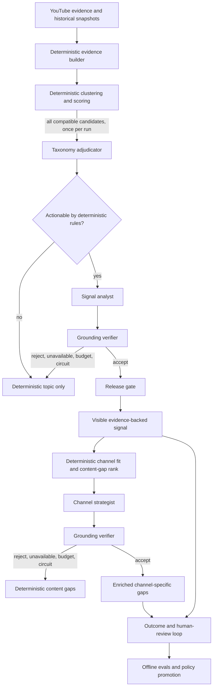

# EarlySignal: evidence-first LLM и агентная архитектура

Статус: архитектура `evidence-decision-graph-v1` реализована за выключенным по
умолчанию feature flag. Для реальных вызовов нужен серверный `OPENAI_API_KEY`.

## Архитектурное решение

EarlySignal не должен быть свободным «роем» из нескольких LLM-персон, которые
обсуждают тренд друг с другом. Для batch trend intelligence это увеличивает
стоимость, дублирует ошибки и затрудняет воспроизводимость.

Используется управляемый приложением evidence decision graph:

1. Код собирает и нормализует evidence.
2. Код рассчитывает score, lifecycle, channel fit и content-gap rank.
3. Узкие LLM-специалисты получают неизменяемые входные пакеты и возвращают
   строгий JSON.
4. Отдельный grounding verifier проверяет каждый материальный LLM-вывод.
5. Детерминированный release gate принимает результат или возвращает прежний
   deterministic fallback.
6. Все шаги объединяются в trace одного `TopicPipelineRun`.

LLM не является оркестратором и не имеет прямого доступа к БД, shell, сети,
score-функциям или произвольным tools.

## Почему не четыре автономных агента

Старая схема `Evidence Analyst → Taxonomist → Strategist → Skeptic` смешивала
задачи разных уровней:

- извлечение evidence лучше выполнять кодом, потому что источники уже хранятся
  в БД;
- taxonomy работает на наборе кандидатов, а content strategy — на конкретной
  паре `workspace × topic`;
- auditor не должен участвовать в создании текста, иначе проверка перестаёт
  быть независимой;
- «главный агент» не должен самостоятельно выбирать, какие данные прочитать и
  какие результаты опубликовать.

Правильная единица изоляции — не персона, а задача с отдельным контрактом,
authority boundary и eval-набором.

## Production graph

## Узлы и их полномочия

| Узел | Задача | Может менять | Не может менять |
|---|---|---|---|
| Evidence builder | Собрать bounded evidence packet | Порядок и лимит evidence | Источник, текст, метрики |
| Taxonomy adjudicator | Точное имя, aliases, safe merge | Label и допустимые aliases | Score, разные products/facets, evidence |
| Signal analyst | Thesis и `why growing` | Только narrative-поля | Score, lifecycle, rank, evidence |
| Grounding verifier | Проверить entailment и scope | Только `accept/reject` и findings | Переписывать результат или score |
| Channel strategist | Конкретизировать готовые gaps | Title, promise, why now, differentiation | Rank, feasibility, occupied/open cells |
| Release gate | Выпустить или откатить артефакт | Выбор LLM/fallback | Содержание evidence и score |
| Outcome evaluator | Связать решение с результатом | Eval labels и агрегаты | Задним числом менять evidence |

Ни один model step не выполняет `INSERT`, `UPDATE` или внешний tool call.
Приложение валидирует результат и само решает, что сохранить.

## Evidence contract

Каждый model step получает только bounded packet:

- `video:<id>` — title и ограниченный description;
- `video-snapshot:<id>` — сохранённый views/hour, outlier ratio, channel и
  publication time;
- `transcript-segment:<id>` — только сохранённый evidence segment;
- `comment:<id>` — только минимальный текст репрезентативного комментария;
- deterministic metrics — read-only значения.

Модель возвращает только ссылки из этого allowlist. Неизвестная ссылка делает
результат `rejected`.

В production запросы используют Structured Outputs и `store=false`.

## Маршрутизация

### Taxonomy

- Один bounded вызов на pipeline run.
- LLM может объединить только группы, которые уже прошли deterministic
  compatibility guard.
- Разные `primary_entity`, `facet` или domain не склеиваются даже при
  предложении модели.
- При сомнении группы остаются раздельными.

### Topic synthesis

Запускается только если тема уже проходит deterministic actionable gate:

- specificity;
- thesis support;
- независимые каналы;
- baseline coverage;
- outlier/velocity evidence;
- score;
- lifecycle.

Это снижает стоимость и не тратит LLM на темы, которые пользователь всё равно
не увидит.

### Grounding audit

Verifier получает:

- готовый артефакт;
- полный список обязательных targets;
- тот же evidence allowlist;
- deterministic metrics.

Для каждого target он обязан вернуть один verdict:

- `supported`;
- `overstated`;
- `unsupported`;
- `scope_mismatch`.

`accept` допустим только когда все targets имеют verdict `supported`.
Неполный список checks, неизвестный evidence ref или противоречивое решение
отклоняются на уровне приложения.

### Content gaps

Сначала код определяет:

- occupied patterns;
- open cells;
- rank;
- score components;
- timing;
- feasibility;
- channel fit.

Channel strategist может только сделать выбранные gaps конкретными и
публикуемыми. Затем каждый title, promise, `why_now` и differentiation проходит
grounding audit. При отказе сохраняется исходный deterministic gap.

## Политика отказов

| Ситуация | Результат |
|---|---|
| Нет API key | Deterministic fallback |
| Feature flag выключен | Deterministic fallback |
| Provider timeout/5xx/429 после retries | Fallback и failed run |
| Неверная JSON schema | Rejected и fallback |
| Неизвестный evidence ref | Rejected и fallback |
| Auditor недоступен при обязательном audit | Fallback |
| Auditor reject | Fallback |
| Исчерпан общий или task budget | Fallback |
| Открыт circuit breaker | Fallback |
| Cached артефакт валиден | Используется без нового API-вызова |

LLM-сбой не должен останавливать ingestion, clustering, score или выдачу
детерминированных сигналов.

## Бюджеты и model routing

Текущие безопасные defaults:

- общий лимит: `24` provider calls на pipeline run;
- topic synthesis: максимум `8`;
- content-gap synthesis: максимум `6`;
- grounding audits: максимум `12`;
- circuit breaker: `3` последовательных сбоя;
- основной model role: `gpt-5.6-terra`, low reasoning;
- auditor role: отдельно настраиваемая модель, medium reasoning.

Auditor model не нужно автоматически делать самым дорогим. Сначала
сравниваются модели на размеченном eval-наборе. Более дорогой verifier
включается только если статистически снижает unsupported claim rate.

## Trace и наблюдаемость

Каждый `TopicPipelineRun` хранит:

- `llm_policy_version`;
- feature/audit state;
- число реальных provider calls;
- calls по task;
- cache hits;
- model step statuses;
- parent-child связь synthesis → audit;
- release gate decisions;
- fallback reasons;
- circuit state.

Полные inputs не дублируются в trace: они остаются в
`llm_intelligence_runs` с input hash, evidence refs, prompt/model version,
validation, usage, latency и provider response id.

## Evals

### Taxonomy

- false merge rate;
- missed merge rate;
- stable identity rate между соседними pipeline runs;
- generic label rate;
- entity/facet preservation.

### Topic synthesis

- exact microtrend name preference;
- unsupported claim rate;
- overstatement rate;
- evidence citation precision;
- evidence coverage;
- temporal wording correctness;
- decision usefulness для автора.

### Content gaps

- duplicate-of-occupied rate;
- channel-specificity;
- feasibility consistency;
- distinct angle rate;
- creator preference;
- brief creation rate;
- publish rate.

### End-to-end

- `Act / Watch / Skip` conversion;
- accepted opportunity cost;
- latency;
- cost per accepted signal;
- fallback rate по причинам;
- performance опубликованного видео против channel baseline;
- regressions по каждому prompt/model/policy version.

Модель или prompt не продвигается по субъективному впечатлению. Нужен
before/after eval на одном и том же immutable evidence snapshot.

## Rollout

### Phase 0 — dark

- Feature flag выключен.
- Проверяются миграции, trace, fallback и operational metrics.

### Phase 1 — shadow

- LLM запускается, но пользователь видит deterministic output.
- Сохраняются proposals, audits и сравнение с baseline.
- Размечаются минимум 30–50 тем.

### Phase 2 — reviewed

- LLM-результаты появляются только в review queue.
- Reviewer выбирает причины отказа: broad label, false merge, weak evidence,
  overstatement, duplicate gap, poor channel fit.

### Phase 3 — limited production

- Автопубликация только для artifacts с успешным audit.
- Kill switch остаётся общим.
- Ежедневно отслеживаются fallback, cost и unsupported claim rate.

### Phase 4 — adaptive routing

- Дешёвая модель обслуживает простые случаи.
- Сложные или конфликтные cases маршрутизируются на более сильный verifier.
- Routing policy продвигается только через evals.

## Где действительно нужен Agents SDK

Текущий batch pipeline остаётся на Responses API и application-managed DAG:
здесь важнее idempotency, строгая последовательность и воспроизводимость.

Agents SDK имеет смысл для будущего интерактивного режима `Ask EarlySignal`,
где пользователь задаёт уточняющие вопросы, а аналитик вызывает несколько
read-only tools, сохраняет session state и может запросить human approval.

Даже там specialists лучше подключать как tools под контролем manager, а не
передавать им неограниченное владение разговором.

## Moat

LLM и multi-agent orchestration доступны конкурентам. Защитный слой создают:

1. Исторический evidence graph.
2. Stable topic identity и split/merge history.
3. Point-in-time earlyness timeline.
4. Channel-specific occupied/open content maps.
5. Связь `signal → decision → brief → publish → outcome`.
6. Human review reasons и agent trace labels.
7. Собственный eval-набор реальных creator decisions.
8. Routing policy, обученная на качестве и стоимости конкретных случаев.

Сервис должен учиться не писать убедительнее, а раньше находить проверяемые
возможности, которые конкретный автор действительно способен использовать.

## Активация после получения ключа

1. Сохранить `OPENAI_API_KEY` только в production server environment.
2. Оставить `LLM_REQUIRE_GROUNDING_AUDIT=true`.
3. Включить `FEATURE_LLM_INTELLIGENCE=true`.
4. Запустить shadow run.
5. Проверить trace, cost, failures и audit acceptance.
6. Экспортировать immutable before/after набор для ручной разметки.
7. Только после eval включать LLM output в пользовательской выдаче.

## Официальные источники

- [Agents SDK и Responses API](https://developers.openai.com/api/docs/guides/agents#compare-the-responses-api-and-agents-sdk)
- [Orchestration и границы multi-agent](https://developers.openai.com/tracks/building-agents#orchestration)
- [Trace grading](https://developers.openai.com/api/docs/guides/trace-grading)
- [Safety: trace graders и evals](https://developers.openai.com/api/docs/guides/agent-builder-safety#run-trace-graders-and-evals)
- [Structured Outputs](https://developers.openai.com/api/docs/guides/structured-outputs)
