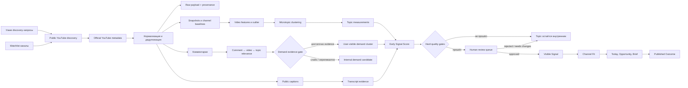

# EarlySignal: текущее состояние платформы и принцип работы

Статус документа: **28 июля 2026 года**  
Назначение: техническо-продуктовый handoff для независимого специалиста  
Основная спецификация: [`CREATOR_TREND_INTELLIGENCE_SCRAPING_FIRST_MVP_CODEX_SPEC.md`](../CREATOR_TREND_INTELLIGENCE_SCRAPING_FIRST_MVP_CODEX_SPEC.md)

> Этот документ описывает фактически реализованную систему и отдельно отмечает
> известные ограничения. Цифры продакшена являются снимком на указанную дату и
> будут меняться по мере работы сборщиков.

## 1. Кратко о продукте

EarlySignal — private-beta сервис для YouTube-креаторов в англоязычной нише
AI/technology. Его задача — находить не просто популярные темы, а конкретные
сюжеты, которые:

- начали расти сразу у нескольких независимых каналов;
- показывают результат выше исторической нормы каждого канала;
- ещё не дошли до полного насыщения;
- содержат подтверждённые вопросы, возражения или запросы аудитории;
- подходят конкретному каналу по тематике, формату и скорости производства.

Главный пользовательский результат — ответ на вопрос:

> **Какое видео стоит сделать следующим, почему именно сейчас и на каких
> доказательствах основана рекомендация?**

Платформа не генерирует полный сценарий и не публикует видео автоматически. Она
даёт сигнал, evidence-карточку, рекомендованный угол и структурированный brief.

## 2. Что уже доступно пользователю

Рабочий private-beta стенд развёрнут по адресу
[`http://45.129.124.109`](http://45.129.124.109). Доступ защищён на уровне
reverse proxy; данные доступа передаются отдельно.

| Раздел | Что делает |
| --- | --- |
| **Today** | Главная страница с максимум тремя решениями: Act, Watch или Skip. На карточке сразу видны конкретная идея видео, why now, why this channel, open angle, publish-by, production time, evidence bucket и главный риск. |
| **Opportunities** | Библиотека конкретных video opportunities без raw scores. Детальная страница разделена на Decision, Content gap, Evidence, Lifecycle и Why this channel; технические детали закрыты по умолчанию. |
| **Briefs** | Одностраничные producer handoffs: audience promise, gap, structure, hooks, title/thumbnail directions, claims policy, production notes, Copy, Share, Markdown export и production status. |
| **Results** | Автоматически предложенные связи с опубликованными видео и channel-relative 24h/7d performance без causal claims. |
| **Settings** | Channel fit, production envelope, monitored channels, quiet digest notifications и optional read-only YouTube Analytics. |
| **Admin → Operations** | Readiness, свежесть, очереди, ошибки, backup/recovery и продуктовые метрики. |
| **Admin → Providers** | Провайдеры, discovery-запросы, ingestion runs, видео-интеллект, topic/demand/transcript pipelines, relevance rejection rate, raw fetches и replay. |
| **Admin → Review** | Ручная проверка live-кандидатов до публикации: evidence, comment relevance, false-positive risks, lifecycle, editorial overrides, approve/reject и полный audit trail. |
| **Admin → Queries** | Evidence-anchored query suggestions, отдельные approve/activate actions и automatic low-precision demotion. |
| **Admin → UX analytics** | Decision/onboarding funnel и timing metrics для private-beta usability analysis. |
| **Onboarding** | Три шага за 2–3 минуты: подключить канал, подтвердить fit, выбрать 3–5 monitored channels; в конце показана явно маркированная example opportunity. |

Старая URL-схема `/digest`, `/signals`, `/pulse`, `/watchlists` и `/outcomes`
сохранена как compatibility redirects. Admin-навигация видна только
workspace owner/admin. Интерфейс адаптивный: основные решения доступны на
desktop и mobile, а Opportunity Detail имеет mobile sticky actions.

## 3. Фактическое состояние продакшена

Read-only снимок на **28 июля 2026, около 13:06 UTC**:

| Метрика | Значение |
| --- | ---: |
| Нормализованные live YouTube-видео | 1 263 |
| Видео с хотя бы одним snapshot | 1 263, то есть 100% |
| Записей channel baseline | 946 |
| Feature records | 1 263 |
| Активные микро-темы | 6 |
| Активные live-сигналы | 2 |
| Одобренные live-сигналы, доступные пользователю | 1 |
| Изолированные demo-сигналы | 5, автоматически одобрены только в demo-контуре |
| Видео, назначенные активным темам | 32 |
| Видео с выборкой комментариев | 16 |
| Live-комментарии в последнем demand run | 658 |
| Проверено relevance gate | 2 482 |
| Принято как релевантные evidence | 23 |
| Отклонено как нерелевантное evidence | 2 459, то есть 99,1% |
| User-visible live demand clusters | 1 |
| Internal live demand candidates | 0 |
| Темы с live demand evidence | 1 |
| Транскрипты | 1 |
| Transcript coverage среди текущих кандидатов | 3,1% |
| Ошибки snapshot jobs | 0 |
| Состояние API/PostgreSQL/Redis/worker/web | Running; API, PostgreSQL и Redis healthy |

Текущие активные live-кандидаты:

1. **AI video generation workflows without recurring subscriptions**
   - lifecycle: Seed;
   - 8 evidence-видео из 4 независимых каналов;
   - медианный channel-relative outlier: 2,13×;
   - review status: `approved`;
   - пользовательское решение: `Skip`, потому что сигнал остаётся хрупким и
     Channel Fit после conservative evidence downgrade низкий.
2. **AI agents workflows without recurring subscriptions**
   - review status: `rejected`;
   - причина: `false_topic_merge` — широкие AI-agent tutorials не подтверждают
     узкий тезис про отсутствие recurring subscriptions.

Таким образом production-feed использует только live-режим и показывает один
конкретный, прошедший human review сигнал. Отрицательное решение `Skip` является
полезным результатом: сервис не маскирует слабую actionability высоким raw
score и не подмешивает demo-сигналы в production.

В качестве реального owned/reference профиля для проверки персонализации сейчас
используется YouTube-канал **Matt Wolfe**. Его последние видео формируют
исторический профиль форматов, длительности и тематического соответствия.

## 4. Система целиком



## 5. Discovery и ingestion

### 5.1 Источники

Провайдеры скрыты за типизированными интерфейсами. Бизнес-логика не должна
зависеть от формы ответа конкретного API или парсера.

Текущая маршрутизация:

- **discovery**: сначала публичный `youtube_web` parser, затем официальный
  YouTube provider при наличии ключа;
- **video/channel metadata**: официальный YouTube Data API;
- **comments**: официальный API, затем публичный web fallback;
- **transcripts**: публичные native/auto-generated YouTube captions;
- **recent channel uploads**: public web/RSS, затем официальный API.

Система поддерживает retry, provider health, budget accounting, routing
decisions и circuit breaker. CAPTCHA solving, fingerprint spoofing,
login-only scraping, credential pooling и хранение полных видео запрещены.

### 5.2 Узкие поисковые запросы

Вместо запросов уровня `AI tools` используются более конкретные intent-запросы:

- `AI agent recurring task real workflow`;
- `AI agent beginner no code`;
- `new open source AI model release`;
- `free local unlimited AI video generator`;
- `coding agent production deployment`;
- `AI tool benchmark independent test`;
- `AI model security failure`;
- `humanoid robotics real world demo`.

Старые широкие запросы автоматически деактивируются.

Cadence зависит от приоритета:

| Priority | Минимальный интервал |
| ---: | ---: |
| 0 | 15 минут |
| 1 | 1 час |
| 2 | 4 часа |
| 3 | 24 часа |

К интервалу добавляется стабильный jitter, чтобы задания не стартовали
одновременно. Запуски имеют idempotency key.

### 5.3 Нормализация

После discovery система:

1. дедуплицирует результаты по canonical YouTube `video_id`;
2. загружает canonical metadata видео и канала;
3. сохраняет/обновляет `youtube_channels` и `youtube_videos`;
4. записывает discovery occurrence;
5. создаёт provenance каждой нормализованной field;
6. сохраняет ссылку на immutable raw provider payload;
7. планирует snapshots;
8. пересчитывает features и baseline затронутых каналов.

Один ролик может быть найден несколькими запросами и провайдерами, но в
нормализованном слое остаётся одним видео.

## 6. Историческая калибровка видео

### 6.1 Snapshot schedule

Для видео планируются snapshots на возрасте:

`30m, 1h, 3h, 6h, 12h, 24h, 48h, 72h, 7d, 14d, 30d`.

Snapshot хранит:

- views, likes и comments;
- views per hour;
- likes/comments per 1 000 views;
- точный возраст видео;
- provider fetch;
- качество и признак estimate.

Если видео найдено слишком поздно, уже пропущенные точки помечаются `skipped`,
а не подделываются.

### 6.2 Channel baseline

Для каждого канала собирается история последних публикаций. Сейчас worker
backfill’ит до 15 uploads на канал, если baseline ещё не был подготовлен.

Основные baseline-метрики:

- median views на 1h, 6h, 24h, 72h и 7d;
- median views/hour;
- engagement per 1 000 views;
- top quartile и top decile последних просмотров;
- upload frequency;
- normal video duration;
- возрастная кривая просмотров.

Возрастная кривая использует коэффициент:

```text
curve_coefficient = views / age_hours^0.65
expected_views = median(curve_coefficient) × age_hours^0.65
outlier_ratio = actual_views / expected_views
```

Если для возрастной точки есть достаточно прямых samples, используется её
median. Затем идёт age curve, затем top-quartile fallback. При недостатке
истории ratio остаётся нейтральным `1.0×`, а низкое baseline coverage повышает
fragility и может не пропустить сигнал.

Это позволяет сравнивать ролики малых и больших каналов относительно их
собственной нормы, а не по абсолютным views.

## 7. Формирование конкретных микро-тем

Текущая версия: `live-microtopic-clustering-v4`.

### 7.1 Domains

Из title, ограниченного description-context и transcript evidence извлекаются
домены:

- Chinese AI models;
- Coding agents;
- AI video generation;
- AI agents;
- AI models;
- AI productivity;
- AI robotics;
- Developer tools;
- Productivity.

Также распознаются product entities, например OpenAI, Claude Code, ChatGPT,
Gemini, Kimi, DeepSeek, Qwen, Cursor, Windsurf, NVIDIA, Sora, Veo, Runway,
Kling, Luma, ComfyUI и Ollama.

### 7.2 Facets

Широкий domain делится по конкретному пользовательскому сюжету:

- free/local/unlimited;
- beginner/no-code;
- applied/task-specific workflow;
- production/deployment;
- open source/self-hosted;
- release wave;
- direct comparison;
- security failure.

Кластер имеет стабильную identity из `domain + facet + product anchor`.
Release и comparison без явно распознанного продукта не создаются: это
защищает от объединения несвязанных новостей в тему `new AI tools`.

До пользовательского topic допускаются только группы минимум из:

- 3 видео;
- 3 независимых каналов.

## 8. Early Signal Score

Текущая версия: `early-signal-score-v3-quality`.

Итоговый score детерминирован и не задаётся LLM:

```text
score =
  0.22 × momentum
  + 0.16 × creator_diversity
  + 0.16 × outlier_strength
  + 0.15 × audience_demand
  + 0.12 × novelty
  + 0.10 × cross_community_spread
  + 0.09 × search_visibility_growth
  - 0.14 × saturation_penalty
  - 0.10 × fragility_penalty
```

Все компоненты нормализуются в диапазон 0–100.

| Компонент | Что измеряет |
| --- | --- |
| Momentum | Новые видео за 24/72h, ускорение публикаций и aggregate view velocity. |
| Creator diversity | Доля независимых каналов и распространение по размерам каналов. |
| Outlier strength | Median и top channel-relative outlier. |
| Audience demand | Сила повторяющегося intent в комментариях. |
| Novelty | Количество устойчиво распознанных entities. |
| Cross-community spread | Независимые каналы за 72h и разные size buckets. |
| Search visibility | Изменение discovery appearances. |
| Saturation penalty | Число недавних видео, крупных каналов и их доля. |
| Fragility penalty | Зависимость от одного видео/канала, provider coverage, snapshots, baselines, transcripts и specificity. |

### 8.1 Hard quality gates

Даже высокий score не гарантирует появление в интерфейсе. Кандидат попадает в
human review только при одновременном выполнении условий:

- specificity не ниже 65;
- минимум 2 видео за последние 72 часа;
- минимум 3 независимых канала всего;
- минимум 2 независимых канала за 72 часа;
- минимум 50% каналов имеют калиброванный baseline;
- median outlier не ниже 1,1×, **или** top outlier не ниже 1,8× при отсутствии
  чрезмерной зависимости от одного velocity source;
- score не ниже 30;
- lifecycle не `Saturated` и не `Declining`.

Поэтому внутренних topics обычно больше, чем кандидатов на review, а
пользовательских signals — не больше числа явно одобренных кандидатов.

### 8.2 Lifecycle

- **Seed** — мало независимых подтверждений;
- **Emerging** — минимум три канала и достаточный текущий momentum;
- **Breakout** — высокий momentum и минимум пять каналов;
- **Mass Market** — сильное участие крупных каналов;
- **Saturated** — saturation penalty достиг критического уровня;
- **Declining** — нет новых публикаций за 72 часа.

### 8.3 Confidence

Confidence зависит от количества видео/каналов, snapshot coverage, baseline
coverage и specificity. Transcript coverage отображается и влияет на
fragility, но отсутствие captions само по себе не блокирует сигнал.

### 8.4 Human review перед публикацией

При включённом `FEATURE_SIGNAL_REVIEW_QUEUE` каждый live-кандидат после
детерминированных gates получает workspace-scoped review record со статусом:

- `internal_candidate`;
- `needs_review`;
- `approved`;
- `rejected`;
- `needs_changes`;
- `published`;
- `expired`.

Reviewer видит сохранённые видео-, comment- и transcript-evidence,
false-positive risks, demand/saturation, lifecycle timeline и будущую
decision-card. Он может:

- одобрить или отклонить кандидат с reason code;
- запросить split/merge темы;
- отметить late signal, weak evidence или irrelevant demand;
- выбрать evidence, которое разрешено показывать пользователю;
- уточнить thesis и opportunity без изменения детерминированного score.

Каждое действие записывается как append-only audit event и поддерживает
idempotency key. Массового approve намеренно нет: это защищает от публикации
нескольких слабых тем одним кликом.

Статус review является строгим publication gate. Неодобренный live-сигнал не
попадает в feed/detail/digest, из него нельзя создать action, brief или
outcome. После approval фиксируется момент первого пользовательского
появления. Demo records автоматически одобряются детерминированно, но остаются
изолированными от live-данных.

## 9. Комментарии и audience demand

Система выбирает перспективные видео темы, получает top и newest comments,
дедуплицирует их и хранит минимально необходимый набор:

- text;
- source video;
- timestamps;
- likes/replies;
- hash автора вместо публичного профиля;
- provider provenance.

Rule-based intent classifier выделяет:

- explanation/tutorial requests;
- comparison;
- test/proof;
- skepticism/objections/corrections;
- missing use cases;
- regional requests;
- pricing;
- privacy/safety;
- update requests;
- generic praise/criticism;
- spam/irrelevant.

После этого каждый live-комментарий проходит отдельный детерминированный
`comment-topic-relevance-v1`. Он проверяет цепочку
`comment ↔ source video ↔ topic entities/claims` и сохраняет:

- semantic similarity комментария к теме и исходному видео;
- overlap с product/entity anchors;
- поддержку claim concepts;
- intent actionability;
- вероятность duplicate/echo и spam;
- accepted/rejected, reason codes, input fingerprint и model version.

Текущий результат хранится отдельно от append-only журнала классификаций и
ручных overrides. Replay идемпотентен: неизменившийся вход не создаёт новый
event, а ручное решение reviewer сохраняется поверх будущих model replays.

User-visible demand cluster создаётся только если есть минимум:

- 3 релевантных комментария;
- на 2 видео;
- у 2 независимых каналов;
- от 3 разных commenter hashes;
- median relevance не ниже `0.70`;
- 1 high-actionability comment;
- entity или claim support для темы с product anchor.

Representative quotes в UI являются verbatim stored comments и содержат
название и ссылку на source video. Общие вопросы без actionable intent не
используются как market demand. Слабые группы сохраняются как
`internal_candidate` для диагностики, но не влияют на score, opportunities и
пользовательские claims. Пользователь видит понятную силу evidence:
`Strong`, `Moderate` или `Weak`, а не сырые classifier decimals.

Admin → Review позволяет принять, отклонить или вернуть к model decision
отдельный комментарий. Admin → Providers показывает evaluated/accepted/rejected,
rejection rate, median relevance и запускает полный replay.

## 10. Транскрипты

Для небольшого набора ценных evidence-видео система пытается получить public
native или auto-generated captions.

Хранятся:

- normalized full text;
- language и transcript type;
- extractive summary;
- entities;
- content format/narrative angle;
- timestamped segments;
- quality score и provenance.

Пользовательскому API выдаются только ограниченные summaries и короткие
timestamped excerpts. Внешняя audio transcription и загрузка полного видео
отключены.

Текущее покрытие низкое — 4,1%. Это graceful degradation: сигнал может
существовать без captions, но его transcript coverage честно показан.

## 11. Персонализация под канал

Owned-канал подключается через onboarding или monitored channels. Из его
описания и последних публикаций строится `ChannelProfile`:

- audience description;
- language/geography;
- topic keywords;
- preferred formats;
- creator expertise;
- production capabilities;
- exclusions и strategic goals;
- normal duration;
- production time range;
- title style.

Текущая формула `channel-fit-v1`:

| Компонент | Вес |
| --- | ---: |
| Topical relevance | 24% |
| Audience overlap | 12% |
| Format compatibility | 12% |
| Authority/credibility | 12% |
| Production feasibility | 12% |
| Historical performance similarity | 14% |
| Timing feasibility | 14% |

Дополнительно вычитаются cannibalization и brand-risk penalties.

Для каждого сигнала создаются до трёх opportunities:

1. evidence-led response на strongest demand;
2. independent real-world test;
3. structured comparison/map of approaches.

Opportunity содержит audience promise, why now, evidence IDs, format, effort,
production time, best publish window, title directions и список того, что
нельзя утверждать без доказательств.

## 12. Пользовательский workflow

1. Пользователь подключает owned-канал.
2. Система собирает историю и строит ChannelProfile.
3. Система пропускает live-кандидат через hard gates и human review.
4. Только одобренный сигнал становится видимым пользователю.
5. Пользователь просматривает ранжированные live-сигналы.
6. В Signal Detail проверяет:
   - откуда взялся score;
   - какие видео являются evidence;
   - outlier каждого видео;
   - comment/transcript evidence;
   - diffusion и saturation;
   - почему сигнал подходит его каналу.
7. Пользователь сохраняет или dismiss’ит сигнал с причиной.
8. Из выбранной opportunity создаёт brief.
9. После публикации связывает YouTube outcome с brief/signal.
10. Pulse учитывает funnel и успешные outcomes.

Это уже реализованный контур продукта. Однако данных реальных outcomes пока
недостаточно, чтобы автоматически обучать scoring weights.

## 13. Evidence и provenance

Каждый visible claim должен разрешаться в хранимое доказательство:

- signal → topic;
- topic → topic/video memberships;
- evidence video → canonical YouTube ID;
- views/outlier → video snapshot + channel baseline;
- quote → stored comment + source video;
- transcript excerpt → transcript segment + timestamp;
- normalized field → field provenance;
- provenance → provider fetch;
- provider fetch → immutable raw payload reference.

Demo и live records разделены полем `source_kind`/data mode. Demo reseed не
должен удалять live provider payloads, signals и пользовательские actions.

## 14. API

Контракты версионированы под `/api/v1`.

Основные user-facing группы:

- workspace context и onboarding;
- channel profile;
- signals list/detail;
- signal actions;
- briefs;
- outcomes;
- digest subscription/generation;
- analytics summary/events.

Основные admin группы:

- provider health, routing, circuits и benchmarks;
- provider fetches, raw payload detail и replay;
- discovery queries/runs;
- monitored channels;
- video intelligence metrics/runs;
- topic intelligence metrics/runs;
- demand intelligence metrics/runs;
- transcript intelligence metrics/runs;
- signal review queue/detail/actions/metrics;
- operations readiness.

Интерактивная OpenAPI-схема доступна у API-сервиса по `/docs`.

## 15. Worker и расписание

Один worker:

1. создаёт/обновляет default discovery queries;
2. backfill’ит историю новых каналов;
3. запускает due discovery;
4. обрабатывает due snapshots;
5. при изменении evidence пересобирает topics и live-кандидатов;
6. создаёт/обновляет review records, не публикуя live-кандидаты автоматически;
7. периодически обновляет comments/demand;
8. пытается получить transcripts;
9. генерирует due digests только из одобренных сигналов.

Главный loop опрашивает состояние каждые 60 секунд. Discovery, demand,
transcript и topic runs имеют временные buckets/idempotency keys, поэтому
частый poll не должен означать повторную внешнюю загрузку.

Текущая production-модель сознательно single-worker. Горизонтальный запуск
нескольких workers не рекомендуется до добавления полноценного distributed
job claiming/locking.

## 16. Архитектура и deployment

### Frontend

- Next.js 16;
- React;
- TypeScript;
- TanStack Query;
- responsive UI.

### Backend

- FastAPI;
- Python 3.12;
- SQLAlchemy;
- Pydantic;
- Alembic;
- deterministic local NLP/embeddings.

### Data

- PostgreSQL 17 + pgvector-compatible image;
- Redis с AOF;
- persistent volume для raw payloads;
- отдельная директория backups.

### Production topology

- `web`;
- `api`;
- `worker`;
- `postgres`;
- `redis`;
- reverse proxy перед loopback-портами web/API.

API выполняет Alembic migrations при старте. Предусмотрены PostgreSQL/SQLite
backup, checksum verification и restore runbook. Целевые показатели private
beta: RPO 24 часа и RTO 4 часа.

Credentials находятся только в deployment environment. API keys, database
passwords и proxy credentials не должны появляться в UI, логах, документации
или git.

На текущем production включены:

- `FEATURE_EARLYNESS_TIMELINE=true`;
- `FEATURE_SIGNAL_REVIEW_QUEUE=true`;
- `FEATURE_COMMENT_TOPIC_RELEVANCE=true`.

Текущая схема БД находится на Alembic revision `d8e63f90a2b7`. Перед
включением relevance gate создан и проверен PostgreSQL custom-format backup.

## 17. Demo mode

Без внешних credentials можно поднять полностью детерминированный demo:

```bash
make setup
make demo
```

Demo:

- использует отдельные synthetic IDs;
- явно маркируется в UI;
- не смешивается с live evidence;
- воспроизводимо создаёт сигналы, actions, briefs и outcomes;
- позволяет пройти основной workflow и e2e tests.

## 18. Запуск и проверка локально

```bash
make setup
make demo
```

После запуска:

- web: `http://localhost:3000`;
- API docs: `http://localhost:8000/docs`.

Полная обязательная проверка:

```bash
make format
make lint
make typecheck
make migrate
make test
make test-e2e
```

Production deployment и recovery описаны в:

- [`docs/deployment.md`](./deployment.md);
- [`docs/backup-recovery.md`](./backup-recovery.md);
- [`docs/private-beta-runbook.md`](./private-beta-runbook.md).

## 18.1 Последние реализованные product slices

- `outcome-association-v1` находит owned uploads, предлагает наиболее вероятный
  brief, хранит альтернативы и требует confirm/reject/correct перед созданием
  подтверждённого outcome;
- `signal-packaging-v1` создаёт evidence-constrained hooks, title directions,
  текстовые thumbnail directions, proof requirements и clickbait mismatch
  risks, но не полный script;
- optional YouTube OAuth хранит state и зашифрованные refresh tokens на сервере,
  использует read-only scopes и импортирует owned analytics для verified fit и
  result metrics;
- `query-expansion-v1` предлагает только product/problem anchored запросы,
  требует отдельные approve и activate, ограничивает очередь и автоматически
  останавливает запросы с precision ниже 15% после достаточной выборки;
- decision-first UX оставляет raw scores, baselines, provenance и lifecycle
  history в backend/admin, но показывает пользователю качественные buckets и
  конкретное действие;
- Watch сохраняет условие ожидания, Skip — короткую причину, Act — production
  time и target publish date;
- usability events и timing metadata доступны в admin UX analytics.

## 19. Что уже является сильной стороной

1. **Evidence-first интерфейс.** Пользователь может открыть любой claim и
   проверить видео, комментарий, транскрипт и provenance.
2. **Channel-relative outlier.** Малые каналы не проигрывают крупным только
   из-за абсолютных просмотров.
3. **Hard gates.** Платформа не обязана показывать много сигналов и может
   оставить тему внутренней, если evidence слабый.
4. **Конкретные microtopics.** Release/comparison привязываются к product
   anchor, а широкие discovery-запросы отключены.
5. **Персональный Channel Fit.** Рекомендация учитывает историю и production
   constraints конкретного канала.
6. **Provider abstraction.** Можно менять discovery/comment/transcript
   поставщиков без переписывания core domain logic.
7. **Накопительный data asset.** Snapshots, baselines, provenance, demand и
   outcomes создают основу будущего moat.
8. **Human publication gate.** Детерминированный score формирует кандидата, но
   live-рекомендация не публикуется без evidence-based решения reviewer;
   причины и история решения сохраняются для будущей калибровки.
9. **Decision-first UX.** Основной пользовательский слой отвечает на вопросы
   «что делать», «почему сейчас», «почему подходит» и «до какого срока» без
   необходимости понимать score methodology.
10. **Controlled learning loops.** Decision reasons, query precision,
    automatic outcome suggestions, owned analytics и usability funnel
    сохраняются как отдельные versioned signals и не меняют deterministic
    weights автоматически.

## 20. Известные ограничения и риски

### P0 — качество пользовательского решения

1. **Relevance gate пока эвристический.** Цепочка
   `comment ↔ video claim ↔ topic entities` уже проверяется и аудируется, но
   локальные lexical/hashing признаки могут ошибаться на парафразах, соседних
   продуктах и неоднозначных местоимениях. Нужна production-разметка для
   калибровки threshold и последующего semantic shortlist.
2. **Transcript coverage низкое.** На текущем проде — 4,1%, есть failed
   provider fetches. Нельзя опираться на transcript semantics как на основной
   источник.
3. **ChannelProfile inference остаётся эвристическим.** URL, handles и sponsor
   boilerplate уже очищаются, а длинный channel mission больше не показывается
   как audience label. Но keywords/expertise и audience overlap всё ещё нужно
   калибровать на явных ответах beta-креатора и реальных outcomes.
4. **Query expansion ещё требует production-калибровки.** Evidence-anchored
   suggestions, queue caps и precision demotion реализованы, но правила
   broadness/product/problem anchors нужно проверить на нескольких неделях
   реального discovery.
5. **Hashing embeddings ограничены.** Они быстрые и детерминированные, но хуже
   современных semantic embeddings разделяют близкие продукты и сюжеты.

### P0 — эксплуатация

6. **Нет полноценной application-level authentication.** UI уже скрывает admin
   navigation и routes от обычной workspace role, но private beta всё ещё
   защищён reverse proxy. Перед внешним multi-tenant запуском нужны login,
   sessions и server-side authorization на каждом admin API.
7. **Стенд использует HTTP.** Перед передачей реальным клиентам нужен домен и
   TLS.
8. **Один worker.** Нет безопасного horizontal scaling.
9. **Off-host backup не подтверждён этим документом.** Скрипты и runbooks есть,
   но необходимы scheduled backup, внешнее хранилище и restore drill.

### P1 — аналитическая зрелость

10. **Outcomes loop пока не калибрует score.** Automatic association, baseline
    snapshots и UI существуют, но нет достаточного количества реальных
    публикаций для learning-to-rank.
11. **Momentum timeline содержит много повторных topic snapshots.** Нужна
    time-bucket aggregation для более чистого sparkline и change 24h/72h.
12. **Часть score thresholds эвристическая.** Их надо калибровать на реальных
    outcomes: uplift против channel baseline, publish timing и false-positive
    rate.
13. **`make ingest-real` использует старый широкий пример запроса.** Default
    scheduler уже использует новые узкие queries, но Makefile/README следует
    синхронизировать.
14. **Рабочий профиль сейчас тестовый.** Matt Wolfe полезен для smoke testing,
    но персонализацию необходимо проверить на реальном beta-креаторе с его
    целями, exclusions и production capacity.

## 21. Оценка moat

Сейчас у продукта есть **основание moat**, но ещё не устойчивый защитный ров.

### Уже формируется

- продольная история views/engagement по возрасту видео;
- channel-specific baselines;
- evidence graph между trend, creators, comments, transcripts и outcomes;
- накопление provider provenance и knowledge о надёжности источников;
- персональные профили каналов;
- feedback/outcome schema.

### Что превратит это в настоящий moat

1. **Outcome-calibrated ranking.** Учиться на том, какие сигналы реально дали
   uplift после публикации, с поправкой на размер канала и production delay.
2. **Cross-channel benchmark graph.** Знать, какие форматы/темы переходят между
   creator cohorts раньше других.
3. **Creator-specific timing model.** Оценивать не общий trend window, а
   вероятность успеть именно этому каналу.
4. **Demand-to-performance attribution.** Проверить, какие types of unmet
   demand предсказывают views, retention и comments.
5. **Longitudinal proprietary dataset.** Чем дольше сохраняются snapshots и
   outcomes, тем сложнее воспроизвести scoring новым конкурентам.

Сам интерфейс и парсеры скопировать можно. Исторические baselines, evidence
graph и outcome-calibrated decisions — потенциально нет.

## 22. Рекомендуемый следующий план

### Этап 1: повысить precision

- разметить текущие review-кандидаты и начать измерять approval/rejection rate;
- откалибровать реализованный comment relevance gate на reviewer overrides;
- очистить ChannelProfile extraction;
- агрегировать topic snapshots в временные buckets;
- улучшить transcript provider routing и диагностику failures;
- синхронизировать Makefile/README с текущими narrow queries;
- собрать ручную экспертную разметку true/false signal на 50–100 topics.

### Этап 2: проверить реальную полезность

- подключить 3–5 beta-креаторов;
- каждую неделю фиксировать `Act / Watch / Skip` и причину;
- связать минимум 20 публикаций с исходными signals;
- сравнивать outcome с собственным baseline канала;
- измерять false-positive rate и time-to-decision;
- калибровать score/gates только после накопления выборки.

### Этап 3: укрепить moat

- построить cohort/channel graph;
- обучить outcome-aware ranking;
- откалибровать controlled query expansion по retained precision и стоимости;
- считать creator-specific opportunity decay;
- внедрить multi-tenant auth, roles и безопасный distributed scheduler.

## 23. Что попросить специалиста проверить

1. Достаточно ли hard gates защищают от ложных трендов?
2. Корректна ли age-normalized baseline модель для разных типов каналов?
3. Нужны ли отдельные модели для Shorts и long-form?
4. Какие признаки добавить для раннего определения trend diffusion?
5. Какое качество показывает `comment-topic-relevance-v1` на ручной
   production-разметке и где нужен более сильный semantic shortlist?
6. Какой minimum outcome dataset нужен для калибровки weights?
7. Какие метрики считать успехом: views uplift, retention, subscriber gain,
   production ROI или комбинацию?
8. Где проходит граница между полезной конкретностью microtopic и чрезмерным
   дроблением?
9. Какие provider/legal/operational риски мешают private-beta запуску?
10. Какие части текущей системы являются реальным moat, а какие — временной
    инфраструктурой?

## 24. Карта репозитория

| Путь | Назначение |
| --- | --- |
| `apps/web` | Next.js UI |
| `apps/api` | FastAPI, schemas, services, models, onboarding и admin |
| `apps/worker` | Ingestion, snapshots, topics, demand, transcripts, fit, digest |
| `packages/provider_sdk` | Типизированные providers и router |
| `packages/clustering` | Entities, embeddings и microtopics |
| `packages/scoring` | Early Signal Score |
| `packages/channel_fit` | Channel Fit formula |
| `packages/demand` | Comment taxonomy и comment-to-topic relevance |
| `packages/transcripts` | Transcript processing |
| `migrations` | Alembic schema migrations |
| `tests` | Unit, integration и e2e tests |
| `docs/decisions` | Architecture Decision Records |
| `deploy` | Reverse proxy/deployment assets |
| `scripts` | Backup, restore и operational scripts |

## 25. Итог

Платформа уже является работающим scraping-first private-beta продуктом:
собирает YouTube evidence, строит исторические baselines, выделяет конкретные
микро-тренды, фильтрует слабые темы, показывает provenance, рассчитывает
Channel Fit и проводит пользователя до brief/outcome.

Главный следующий риск находится не в UI и не в самом сборе данных, а в
**decision quality**:

- действительно ли topic является одним конкретным сюжетом;
- действительно ли комментарии выражают спрос именно на этот сюжет;
- действительно ли ранняя рекомендация даёт creator-specific uplift.

Следующая стадия должна быть сфокусирована на экспертной разметке, beta
outcomes и калибровке, а не на расширении количества функций.
