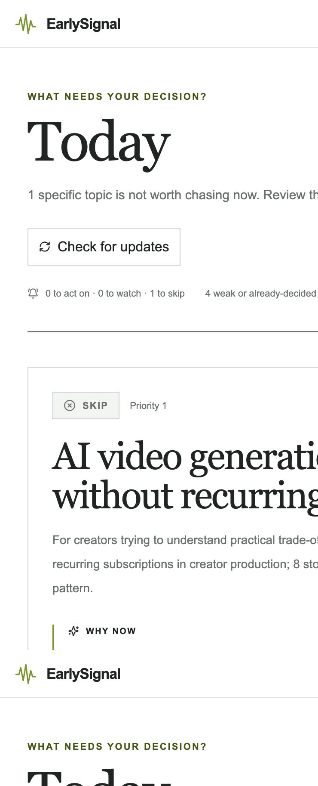
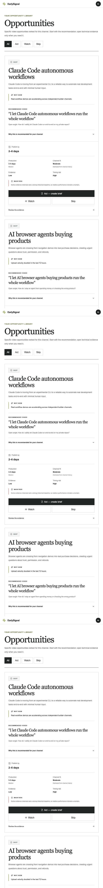
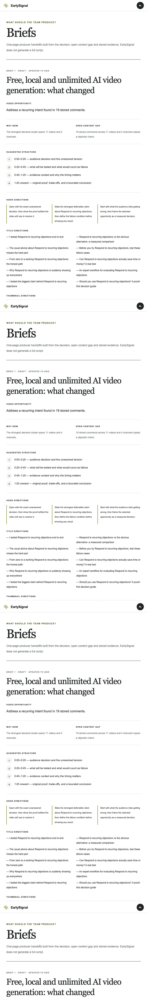
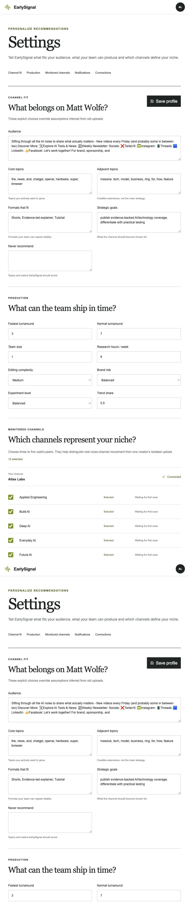
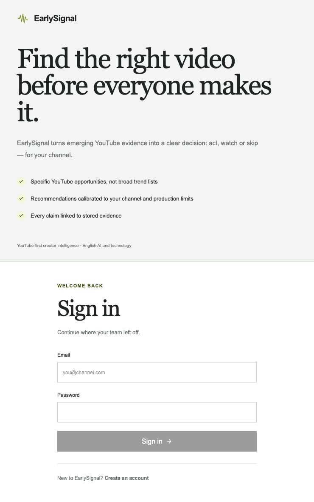
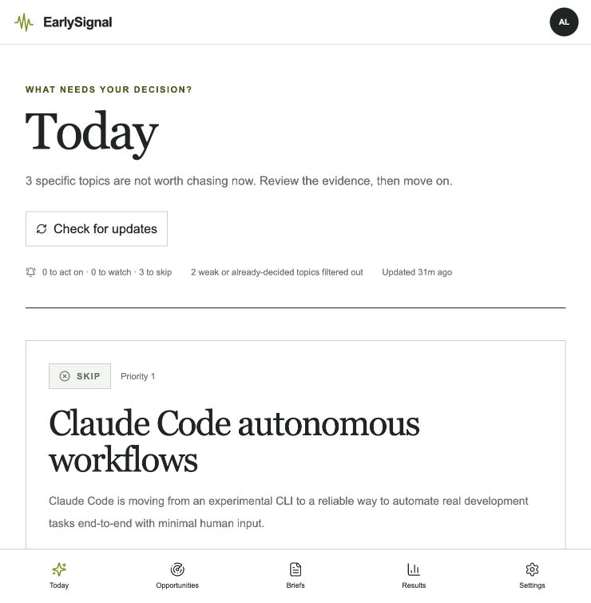

# EarlySignal: аудит готовности продукта

Дата аудита: 28 июля 2026  
Среда аудита: production, `45.129.124.109`

## Краткий вывод

До текущей итерации EarlySignal был функциональным private-beta прототипом:
сбор данных, сигналы, opportunities, briefs, results и настройки работали, но
пользователь попадал прямо в заранее созданный workspace. Это не соответствовало
готовому многопользовательскому сервису.

В текущей итерации обязательный P0-контур закрыт и развёрнут:

- самостоятельная регистрация и вход;
- серверные сессии в `HttpOnly` cookie;
- безопасное хранение паролей;
- разграничение workspace и административных API;
- обязательный онбординг нового пользователя;
- выход и смена пароля с отзывом других сессий;
- HTTPS с автоматическим продлением сертификата и удаление общего Basic Auth.

## Проверенный пользовательский путь

### 1. Today

Основной decision-first экран уже хорошо объясняет, на что стоит действовать
сегодня. Проблема была не в ядре интерфейса, а в отсутствии входного контура и
персонального пустого состояния для нового workspace.

### 2. Opportunities

Рабочий список конкретных возможностей есть. Каждая рекомендация должна
оставаться привязана к сохранённым evidence; это ограничение сохраняется.

### 3. Briefs

Переход от сигнала к контент-решению существует, но первый пользователь должен
сначала настроить канал и production fit.

### 4. Settings

До исправления экран сразу показывал профиль заранее созданного канала и не
содержал управления аккаунтом.

### 5. Отсутствующий вход

Маршрут `/login` отсутствовал. Это было блокирующим P0-дефектом.

### 6. Новый вход и регистрация

Оба публичных маршрута работают через HTTPS. После успешного входа пользователь
возвращается в свой workspace; незавершённая регистрация направляется в
обязательный онбординг.

### 7. Авторизованный продукт

Авторизованный пользователь видит только собственный workspace. Настройки
аккаунта, смена пароля и выход доступны в основном интерфейсе.

## Что реализовано в текущей итерации

### Аккаунты и безопасность

- `POST /api/v1/auth/register`
- `POST /api/v1/auth/login`
- `GET /api/v1/auth/me`
- `POST /api/v1/auth/logout`
- `POST /api/v1/auth/change-password`
- PBKDF2-SHA256 с индивидуальной солью и настраиваемой стоимостью;
- в базе хранится только хэш токена сессии;
- cookie: `HttpOnly`, `SameSite=Lax`, `Secure` в production;
- ограничение повторных попыток входа;
- проверка `Origin` для изменяющих запросов;
- проверка членства для каждого `/workspaces/{workspace_id}/...`;
- отдельный флаг platform admin для `/api/v1/admin/...`.

### Первый запуск

- регистрация создаёт пользователя, workspace, owner membership и состояние
  онбординга одной транзакцией;
- незавершённый пользователь перенаправляется на `/onboarding`;
- пользователь подключает свой YouTube-канал;
- сервис строит профиль канала и предлагает релевантные reference channels;
- пользователь уточняет темы, исключения, форматы и production constraints;
- после подготовки первого digest открывается основной продукт.

### Управление аккаунтом

- данные текущего пользователя показаны в shell и Settings;
- выход доступен из меню аккаунта;
- смена пароля отзывает остальные активные сессии.

### Production-контур

- production-миграция выполнена после проверенной резервной копии PostgreSQL;
- HTTP перенаправляется на HTTPS;
- установлен доверенный сертификат для IP-адреса;
- продление сертификата запускается systemd-таймером дважды в сутки;
- API, web, worker, PostgreSQL и Redis запущены; health checks API, PostgreSQL
  и Redis проходят;
- общий Nginx Basic Auth удалён, доступ контролируется аккаунтами EarlySignal.

## Что ещё необходимо до коммерческого GA

### P0 — до допуска внешних пользователей

- регулярная внешняя резервная копия и плановый тест восстановления;
- production-мониторинг API, worker, ingestion lag и ошибок провайдеров;
- централизованный сбор исключений с алертами;
- политика конфиденциальности, условия использования и контакт поддержки;
- проверка квот YouTube API и бюджетных circuit breakers на реальной нагрузке.

### P1 — private beta

- подтверждение email;
- восстановление забытого пароля через одноразовую ссылку;
- приглашения участников workspace и роли owner/editor/viewer;
- удаление аккаунта и экспорт пользовательских данных;
- понятные empty/loading/degraded states для нового workspace;
- product analytics воронки register → channel connected → first decision;
- уведомления о готовности первого digest.

### P2 — коммерческий запуск

- биллинг и лимиты тарифов (не входят в текущий scraping-first MVP scope);
- собственный домен и транзакционная почта;
- SSO для командных тарифов;
- журнал важных действий пользователя;
- SLA/SLO, публичный status page и регламент incident response.

## Критерий «готово»

Private beta можно считать готовой, когда новый пользователь без ручного
вмешательства проходит путь:

`register → verify identity → connect channel → calibrate fit → first evidence-backed opportunity → create brief → record result`.

Главный продуктовый критерий — не количество найденных «трендов», а доля
opportunities, по которым пользователь принимает осмысленное решение и затем
фиксирует результат.
