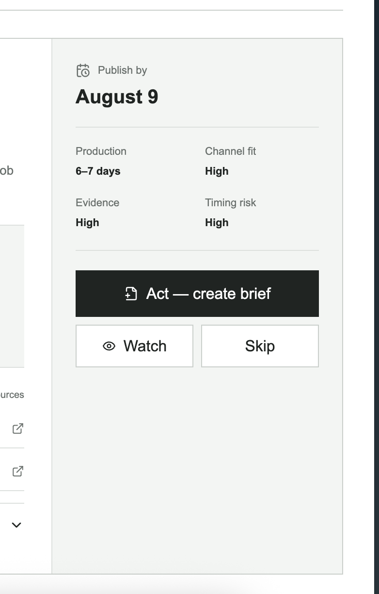
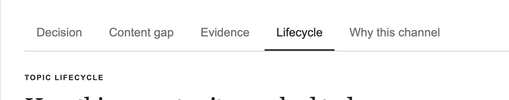
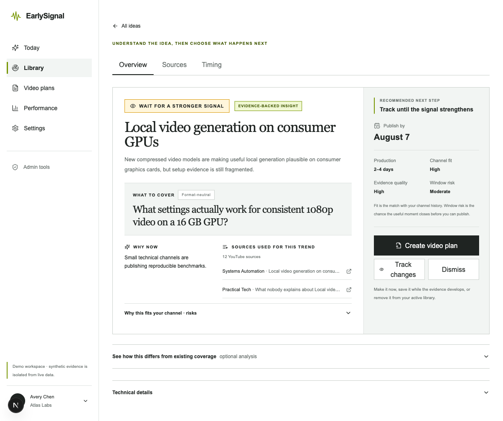
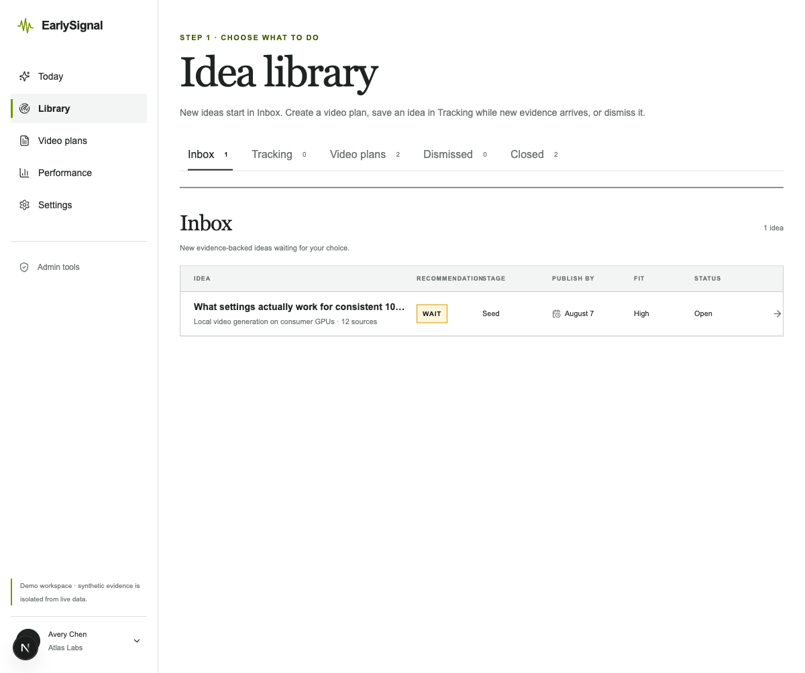
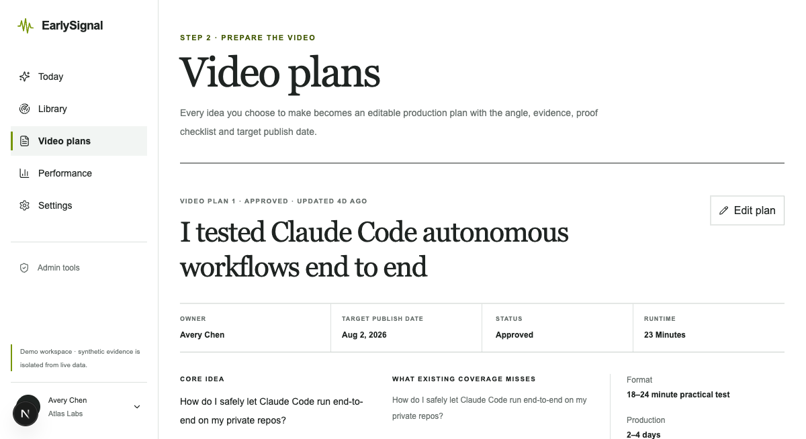
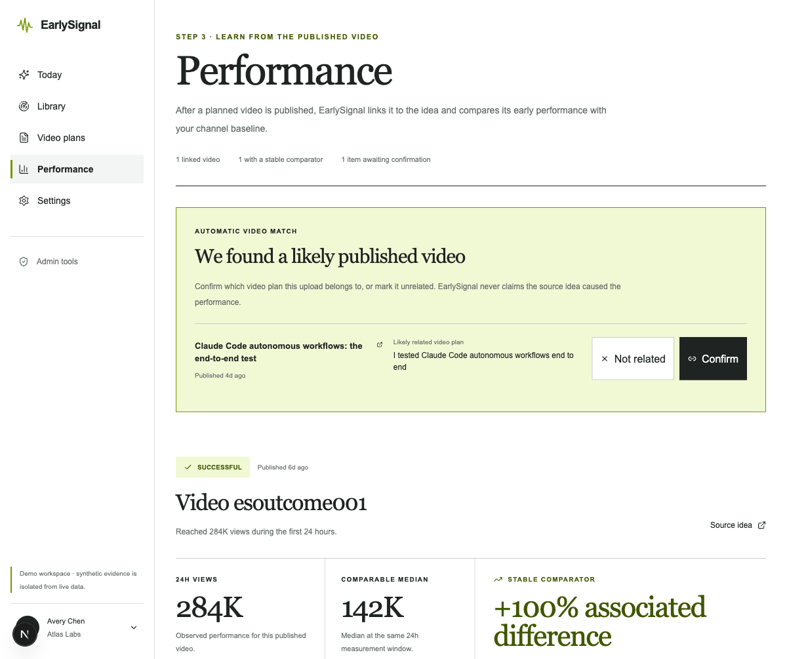
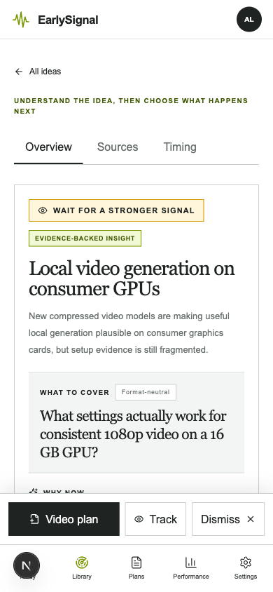

# EarlySignal: аудит механики Watch / Briefs / Results

Дата: 30 июля 2026  
Область: библиотека идей, карточка идеи, действия пользователя, видеопланы и результаты публикаций.

## Итог

До изменений интерфейс смешивал три разных уровня:

1. решение по найденной идее;
2. подготовку ролика;
3. анализ уже опубликованного ролика.

Из-за этого `Watch`, `Briefs`, `Results`, пять вкладок карточки и служебные
значения `Act / Watch / Skip` выглядели как отдельные несвязанные функции.

Новая пользовательская модель:

1. **Idea library** — выбрать, что делать с идеей.
2. **Video plans** — подготовить выбранный ролик к производству.
3. **Performance** — связать опубликованный ролик с планом и сравнить результат
   с базовой линией канала.

## Зафиксированные проблемы

### 1. Действия не объясняли результат

`Act — create brief`, `Watch` и `Skip` требовали знания внутренней модели
продукта. Значения `Evidence: High` и `Timing risk: High` также не объясняли,
что именно должен сделать автор.

Исправлено:

- `Create video plan` — создать редактируемый план ролика;
- `Track changes` — сохранить идею в Tracking и зафиксировать, какого изменения
  пользователь ждёт;
- `Dismiss` — убрать идею из активной работы;
- добавлена явная рекомендация следующего шага;
- `Evidence` переименовано в `Evidence quality`;
- `Timing risk` переименовано в `Window risk` и получило короткое объяснение.

### 2. Пять вкладок дробили одну задачу

`Decision`, `Content gap`, `Evidence`, `Lifecycle`, `Why this channel` заставляли
пользователя собирать решение вручную из разных экранов.

Исправлено:

- `Overview` — сама идея, рекомендация и действия;
- `Sources` — сохранённые доказательства и ссылки;
- `Timing` — динамика и жизненный цикл;
- content gap оставлен внутри `Overview` как необязательный раскрываемый анализ;
- объяснение соответствия каналу и рисков осталось рядом с самой идеей.

## Результат после изменений

### Карточка идеи

### Библиотека идей

Группы отражают состояние работы, а не внутренние статусы:

1. `Inbox` — новые идеи, по которым нужно принять решение;
2. `Tracking` — идеи, сохранённые на потом; их источники и метрики обновляются
   обычным discovery-циклом;
3. `Video plans` — идеи, превращённые в планы;
4. `Dismissed` — убранные идеи;
5. `Closed` — идеи с завершившимся окном.

### Видеопланы

`Briefs` переименованы в `Video plans`. Страница прямо сообщает, что здесь
находятся угол, evidence, обязательные доказательства, структура ролика и дата
публикации.

### Результаты

`Results` переименованы в `Performance`. Механика описана на странице:
EarlySignal находит вероятный опубликованный ролик, пользователь подтверждает
его связь с видеопланом, после чего сервис сравнивает ранние метрики с
сопоставимой базовой линией канала. Интерфейс не заявляет причинность.

### Мобильная версия

Три действия закреплены над нижней навигацией, а вкладки и карточка не создают
горизонтальную прокрутку.

## UX health

Оценка проверенного сценария после изменений: **8/10**.

Сильные стороны:

- один последовательный путь вместо набора внутренних сущностей;
- понятный результат каждого действия;
- ссылки на evidence находятся в карточке и в отдельном разделе `Sources`;
- detail-экран стал короче и легче сканируется;
- мобильные действия остаются в зоне большого пальца;
- кнопки получили полные доступные имена, даже когда мобильная подпись короче.

Оставшиеся риски:

- карточка всё ещё содержит много аналитики ниже первого экрана;
- интерфейс остаётся англоязычным;
- URL и backend-контракты сохраняют старые технические названия
  `/opportunities`, `/briefs`, `/results`, `act/watch/skip`;
- полезность `Track changes` зависит от качества новых evidence и корректной
  работы фонового обновления;
- выбранная причина Tracking сейчас сохраняется как контекст, но отдельного
  уведомления при точном выполнении условия ещё нет.

## Доступность

- вкладки используют роли `tab` и состояние `aria-selected`;
- действия имеют однозначные `aria-label`;
- мобильные кнопки сохраняют текстовые подписи, а не остаются иконками;
- проверены desktop 1200×1005 и mobile 390×844;
- автоматические e2e-проверки контролируют отсутствие горизонтальной прокрутки
  и доступность основных действий.

## Ограничения доказательств

Аудит основан на двух предоставленных пользователем скриншотах и
детерминированном demo workspace. Реальные данные конкретного канала,
длинные локализованные строки, screen reader и браузеры кроме Chromium в этот
проход не проверялись.
