# EarlySignal post-audit baseline — Slice 0

- Status: Accepted baseline
- Date: 2026-07-29
- Scope: Post-audit implementation plan, Slice 0 only
- Product behavior changed: No
- UI redesigned: No
- Score weights changed: No
- Release policy changed: No
- Mandatory human review enabled: No

## 1. Purpose

This baseline freezes the product immediately before the post-audit
implementation program. It gives every later slice a point-in-time answer to:

1. what the current creator flow looks like on desktop and mobile;
2. which `/api/v1` operations exist;
3. which feature flags and release rules are active;
4. which demo and production counts must be explained by later changes;
5. how to roll back a later UI, API, worker, or configuration change.

Authoritative inputs:

- [`CREATOR_TREND_INTELLIGENCE_SCRAPING_FIRST_MVP_CODEX_SPEC.md`](../../CREATOR_TREND_INTELLIGENCE_SCRAPING_FIRST_MVP_CODEX_SPEC.md)
- [`EARLYSIGNAL_POST_AUDIT_IMPLEMENTATION_PLAN_RU.md`](../../EARLYSIGNAL_POST_AUDIT_IMPLEMENTATION_PLAN_RU.md)
- [`EARLYSIGNAL_FULL_PROJECT_AUDIT_PACKAGE_RU.md`](../EARLYSIGNAL_FULL_PROJECT_AUDIT_PACKAGE_RU.md)
- [`post-audit-baseline.json`](../../fixtures/evaluation/post-audit-baseline.json)

The root scraping-first specification remains authoritative where documents
conflict.

## 2. Slice boundary

Slice 0 records state only. It does not:

- change Today hierarchy;
- add sticky actions;
- change Opportunities, Evidence, Content gap, Briefs, Results, Settings, or
  onboarding behavior;
- introduce Candidate / Watch / Act release stages;
- alter score weights, thresholds, snapshot policy, or transcript policy;
- change LLM routing, prompts, models, or budgets;
- enable mandatory signal review;
- add providers or schema tables;
- deploy or restart production.

The new implementation plan is copied into the repository unchanged. Its
SHA-256 is pinned in the fixture.

## 3. Visual baseline

Capture source:

- deterministic local demo seeded from the current code;
- API: `scripts/start_e2e.py`;
- web viewport: 1440×1000 desktop and 390×844 mobile;
- capture date: 2026-07-29;
- mobile document width: 390px;
- mobile horizontal overflow: none observed.

Every accepted file was opened and visually checked after capture. The fixture
pins path, dimensions, route, and SHA-256 for all 14 images.

### Step 1 — Today desktop

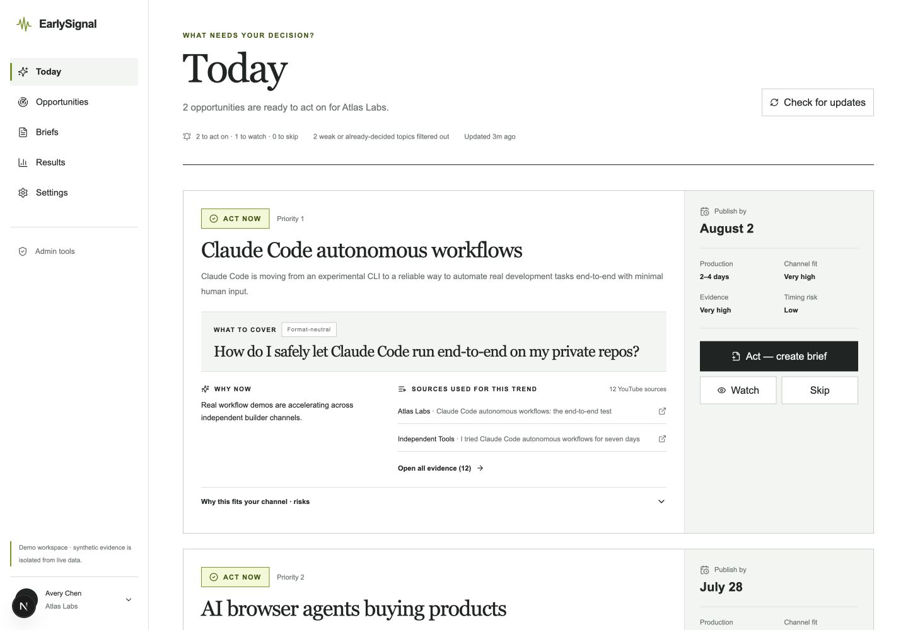

Health: functional, but the topic title dominates the recommended video and
the card exposes more evidence detail than the post-audit target.

### Step 2 — Opportunities desktop

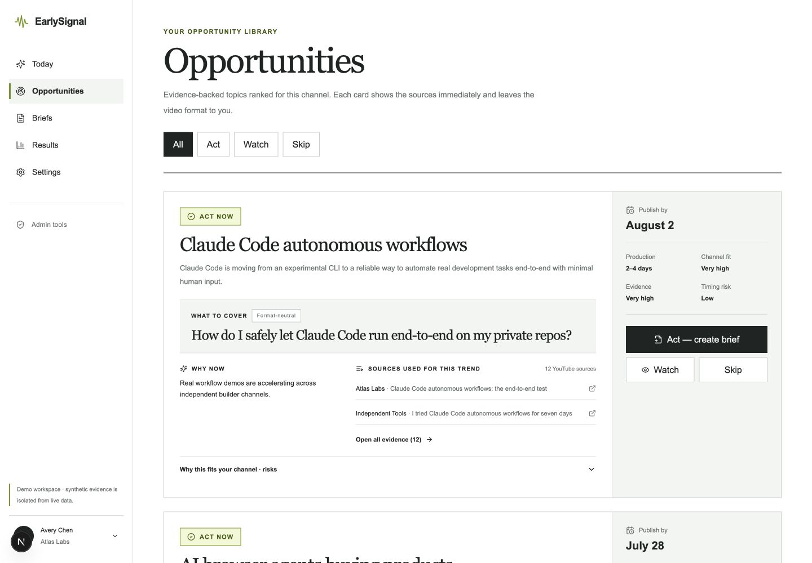

Health: functional, but visually duplicates Today instead of behaving as a
compact opportunity library.

### Step 3 — Evidence desktop

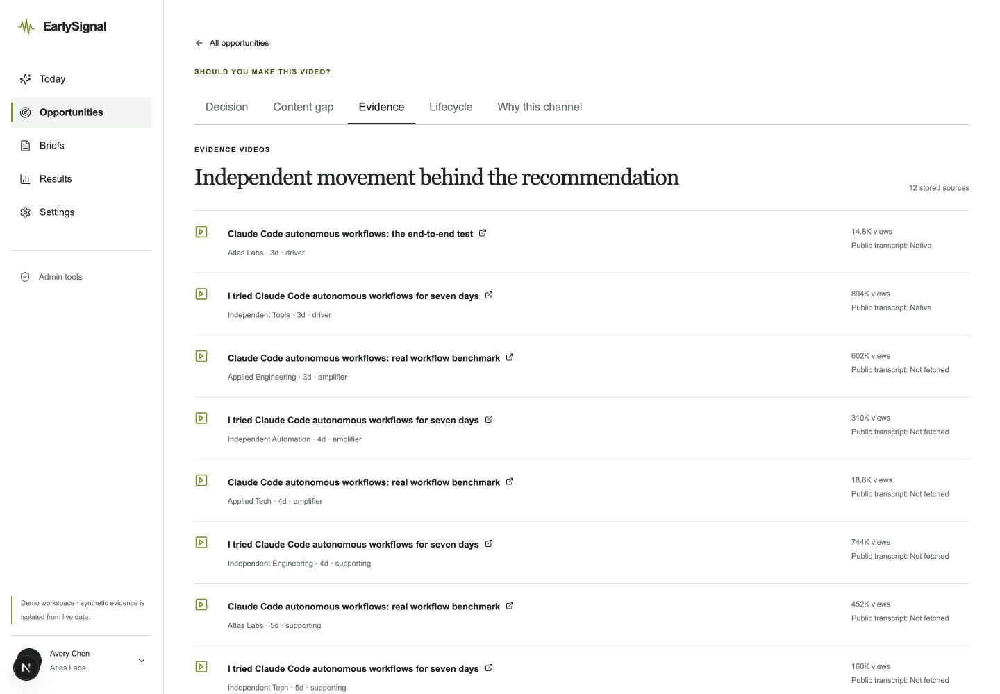

Health: sources are directly auditable, but the default experience is an
undifferentiated long list without Drivers / Amplifiers / Supporting groups.

### Step 4 — Content gap desktop

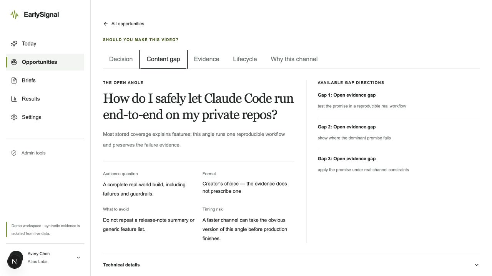

Health: a format-neutral recommended angle is present, but alternatives and
occupied coverage are not yet presented with the hierarchy required by Slice 4.
The tab is client-side state: `?section=content-gap` currently resolves to
Decision, so the baseline was captured by selecting the visible Content gap
tab.

### Step 5 — Briefs desktop

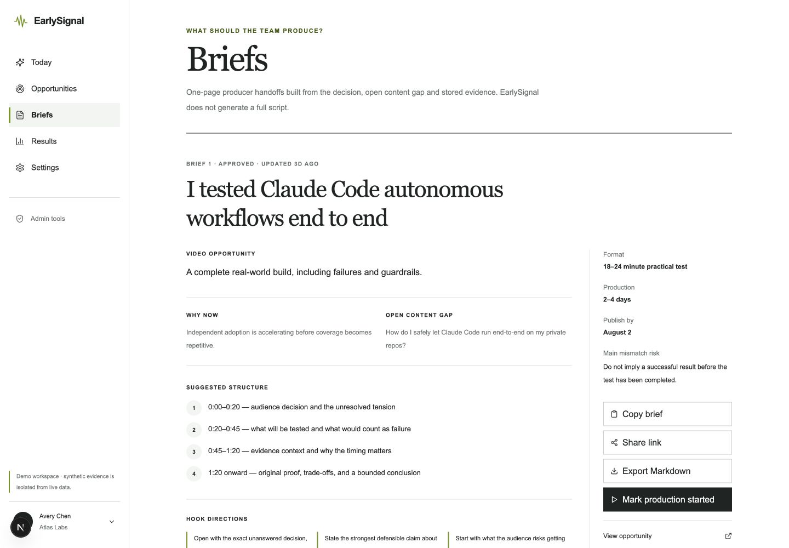

Health: the evidence-linked producer handoff works, but the short suggested
structure does not describe the full promised 18–24 minute video and fields are
not fully editable.

### Step 6 — Results desktop

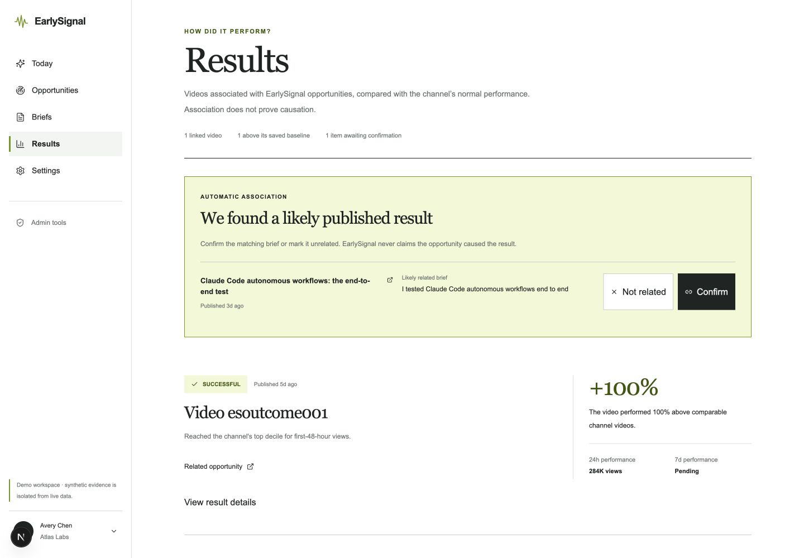

Health: association and non-causal copy are present, but the `+100%` result does
not expose comparator sample size and methodology in the first view.

### Step 7 — Settings desktop

Health: configuration is available, but account, channel strategy, production,
connections, notifications, and security remain on one dense route.

### Step 8 — Onboarding desktop

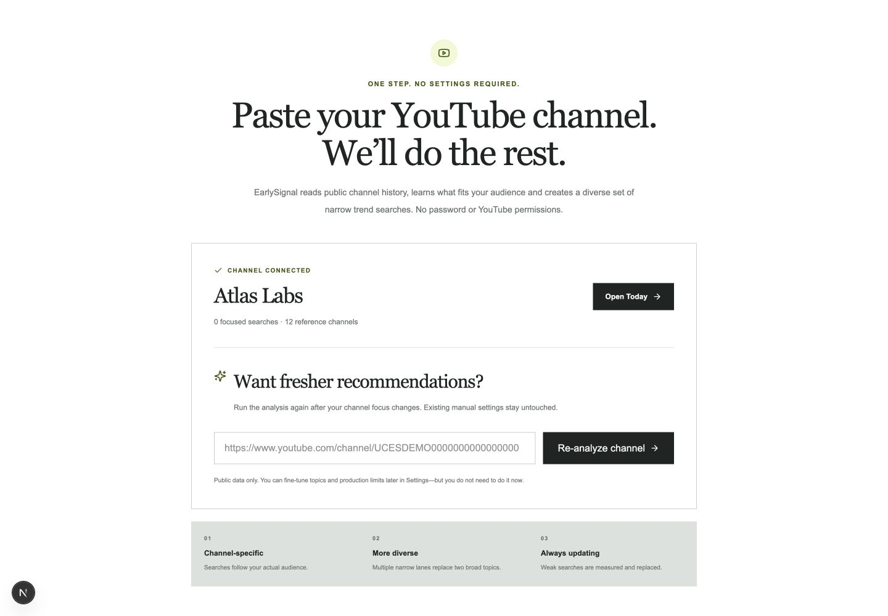

Health: one-channel setup works. The completed state does not yet explain the
inferred channel profile or expected first-analysis wait.

### Step 9 — Login desktop

Health: functional and visually clear. Password recovery and email verification
are not implemented.

### Step 10 — Admin operations desktop

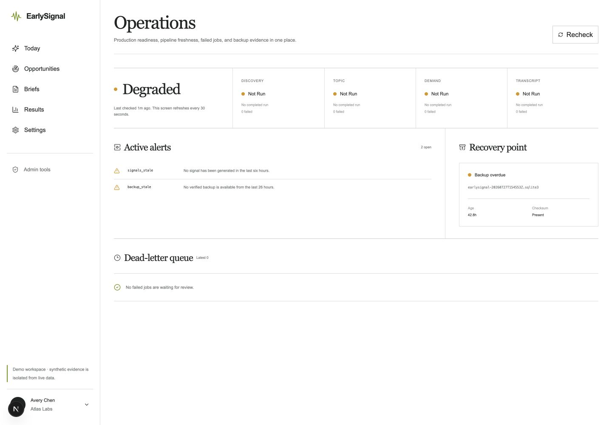

Health: operational state and alerts are visible. Alerts do not consistently
include impact, likely cause, recommended action, and runbook link.

### Step 11 — Admin providers desktop

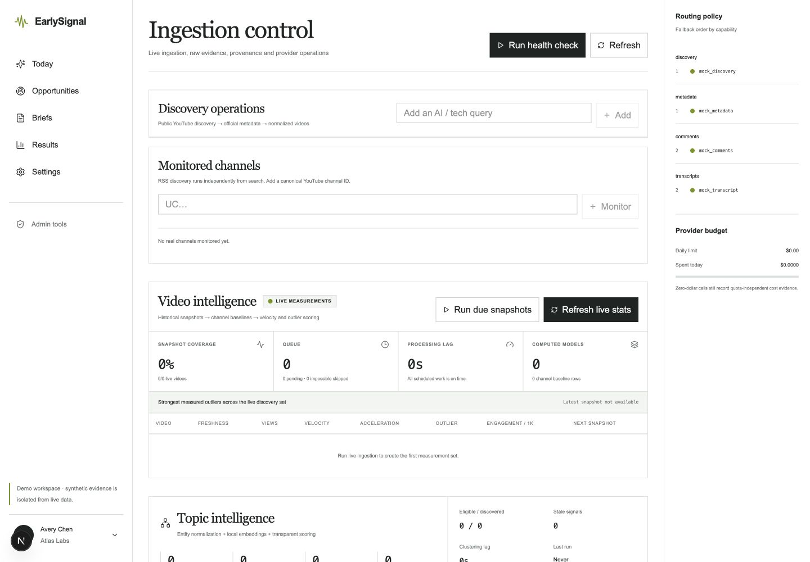

Health: provider routing, cost, and intelligence controls are available. This
remains an operator surface and is intentionally excluded from the creator
navigation.

### Step 12 — Admin review desktop

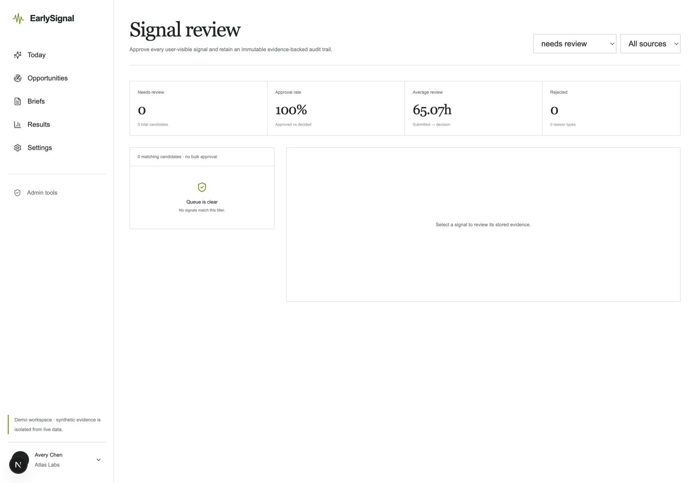

Health: review infrastructure works for QA and shadow evaluation. Production
does not use it as a mandatory release gate.

### Step 13 — Today mobile

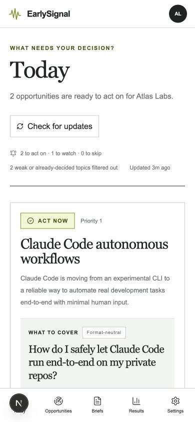

Health: responsive layout has no horizontal overflow, but the recommendation
appears after topic context and primary actions are below the initial viewport.

### Step 14 — Opportunity detail mobile

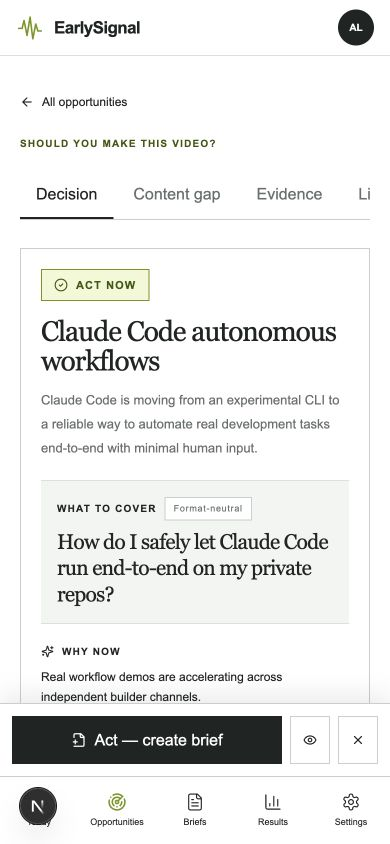

Health: detail tabs and sticky action controls render. Tab overflow, icon-only
secondary actions, focus order, screen-reader labels, safe-area behavior, and
keyboard behavior require explicit Slice 1 verification.

### Accessibility evidence limit

Screenshots establish hierarchy, visible labels, reflow, and obvious target-size
risks only. They do not prove:

- complete keyboard navigation;
- focus visibility and focus order;
- screen-reader announcements;
- semantic heading correctness;
- live-region behavior after Act / Watch / Skip;
- contrast compliance for every state;
- zoom behavior above the captured viewport.

These are acceptance tests for the implementation slices, not claims made by
this baseline.

## 4. Current creator route contracts

| Surface            | Web route                   | Primary API dependencies                              | Current contract                                             |
| ------------------ | --------------------------- | ----------------------------------------------------- | ------------------------------------------------------------ |
| Today              | `/today`                    | context, latest digest, signal feed, analytics events | Up to three decision cards, ordered for action               |
| Opportunities      | `/opportunities`            | signal feed, signal actions                           | Filterable Act / Watch / Skip card list                      |
| Opportunity detail | `/opportunities/{signalId}` | signal detail, decision card, earlyness, packaging    | Decision, Content gap, Evidence, Lifecycle, Why this channel |
| Briefs             | `/briefs`                   | brief list/detail/update                              | Evidence-linked producer handoff                             |
| Results            | `/results`                  | outcomes and suggestions                              | Association confirmation and channel-relative result         |
| Settings           | `/settings`                 | channel profile, channels, digest, OAuth, auth        | Account and workspace configuration                          |
| Onboarding         | `/onboarding`               | onboarding status/auto-setup/complete                 | One-channel automatic setup                                  |
| Login/register     | `/login`, `/register`       | auth endpoints                                        | Cookie-backed account session                                |

Compatibility routes `/digest`, `/signals`, `/outcomes`, `/pulse`, and
`/watchlists` remain in the codebase so existing links can redirect or preserve
older analyst/admin access.

## 5. Current admin route contracts

| Surface      | Route               | Purpose                                      |
| ------------ | ------------------- | -------------------------------------------- |
| Operations   | `/admin/operations` | freshness, failed work, alerts, backups      |
| Providers    | `/admin/providers`  | ingestion, provider routing, health, budgets |
| Queries      | `/admin/queries`    | controlled query expansion                   |
| Review       | `/admin/review`     | data integrity and evidence QA               |
| Evaluation   | `/admin/evaluation` | labels and evaluation reports                |
| UX analytics | `/admin/ux`         | product journey metrics                      |

The complete machine-readable inventory is in
`fixtures/evaluation/post-audit-baseline.json`:

- OpenAPI 3.1.0;
- application version 0.1.0;
- stable product prefix `/api/v1`;
- 96 operations;
- 44 GET, 45 POST, 5 PATCH, and 2 PUT operations;
- canonical full-OpenAPI SHA-256.

No route or response model is changed by Slice 0.

## 6. Current release policy

The production flag `FEATURE_SIGNAL_REVIEW_QUEUE` is disabled.

Consequences:

- mandatory human approval is not a release gate;
- review tables and admin UI remain available;
- review is suitable for data integrity, false merge, unsupported claims,
  complaints, shadow evaluation, and external expert work;
- later automated ACT / WATCH / HIDE policy must be introduced in Slice 8, not
  in this baseline.

The current deterministic creator decision version is
`signal-decision-v1`.

Current behavior:

1. infeasible production window → Skip;
2. Saturated/Declining or saturation penalty ≥90 → Skip;
3. Seed → Watch;
4. strong signal + strong channel fit + supported evidence → Act, unless
   saturation is already rising;
5. moderate signal/fit/evidence → Watch;
6. otherwise → Skip.

User buckets use `score-to-user-bucket-v1` and conservatively downgrade for
fragility, weak baseline coverage, or weak topic specificity.

This is a deterministic decision label, not a calibrated future breakout
probability.

## 7. Feature flags

The fixture contains:

- all defaults parsed from `.env.example`;
- the exact deterministic E2E flags used for this capture;
- the production flag state recorded by the same-day read-only audit.

Production has the post-MVP intelligence and UX suite enabled, including the
LLM layer. Production keeps `FEATURE_SIGNAL_REVIEW_QUEUE=false`.

Demo intentionally enables review infrastructure so the admin surface can be
tested, while demo signals are deterministically auto-approved and remain
isolated from live data.

## 8. Baseline metrics

### Deterministic local demo

| Metric                    |    Count |
| ------------------------- | -------: |
| Workspaces / users        |    1 / 1 |
| YouTube channels / videos | 50 / 300 |
| Video snapshots           |    1,200 |
| Active topics / signals   |    5 / 5 |
| Comments / transcripts    |  15 / 10 |
| Briefs / outcomes         |    2 / 1 |
| Signal actions / reviews  |    2 / 5 |
| LLM runs                  |        0 |
| Provider fetches          |        4 |

Demo LLM calls are disabled, all evidence is synthetic, and all five review
rows are approved for deterministic UI coverage.

### Production

Source: read-only production audit recorded on 2026-07-29 in the full audit
package.

| Metric                                |       Count |
| ------------------------------------- | ----------: |
| Workspaces / users                    |       4 / 4 |
| YouTube channels / videos             | 584 / 6,780 |
| Video snapshots                       |      12,580 |
| Live topics / signals                 |    122 / 66 |
| Approved review rows for live signals |           1 |
| Comments / transcripts                |  3,548 / 28 |
| Briefs / outcomes                     |       2 / 1 |
| LLM runs                              |       2,306 |
| Provider fetches                      |       4,693 |

These are storage counts, not visible recommendation counts. Workspace fit,
signal state, quality gates, creator decisions, and ranking filter the visible
set.

## 9. Rollback plan for later slices

### Before every behavior-changing slice

1. record the deployed image or source revision;
2. export a fresh point-in-time evaluation snapshot;
3. save the current feature-flag values;
4. verify a production database backup and checksum;
5. run the relevant restore drill before schema or storage changes;
6. keep `/api/v1` changes additive unless a migration plan is accepted.

### UI-only rollback

1. disable the slice-specific feature flag where available;
2. redeploy the previous web image;
3. keep additive API fields and stored records;
4. compare Today and the affected route against the pinned screenshots;
5. run frontend unit tests, E2E, and build.

No database rollback is expected for Slices 1–7 when implementation remains
additive.

### API or worker rollback

1. stop scheduling the new job path;
2. disable its feature flag;
3. wait for in-flight idempotent jobs to finish or expire;
4. deploy the previous API/worker image;
5. smoke-test `/health`, `/api/v1/context`, signal feed, detail, brief, and
   outcome reads;
6. preserve new additive columns/tables until a separate cleanup decision.

### Database rollback

1. do not downgrade a live database merely to remove unused additive schema;
2. prefer application rollback with forward-compatible schema;
3. for a destructive migration, stop writers and restore the verified
   pre-migration backup into an isolated database first;
4. validate Alembic revision, row counts, and application reads;
5. promote a restored database only under the production recovery runbook.

### Configuration rollback

1. restore the previous server-side environment file from its protected backup;
2. validate that no secret is printed in logs or command output;
3. restart only the affected service;
4. verify health, auth, provider routing, LLM fallback, and creator reads;
5. record the change in the operational audit trail.

### Slice 0 rollback

Slice 0 adds only documentation, screenshots, a regression fixture, and tests.
Removing those artifacts fully reverts the slice; production does not need a
rollback.

## 10. Known blockers for Slice 1

There is no implementation blocker for Today hierarchy and mobile actions.
Slice 1 must nevertheless prove:

- recommendation is visible before the topic title dominates the page;
- recommendation and primary CTA appear in the first mobile viewport;
- sticky actions respect bottom navigation and safe area;
- Watch and Skip remain keyboard- and screen-reader-accessible;
- action confirmation is announced and unambiguous;
- source detail remains reachable without dominating the first view;
- existing Act / Watch / Skip API behavior remains unchanged;
- desktop and mobile screenshots are recaptured after implementation.

The Next.js development toolbar appears only in the local development DOM and
is not part of the production experience.

## 11. Slice 0 acceptance

| Requirement                                  | Result                            |
| -------------------------------------------- | --------------------------------- |
| Current desktop and mobile UI captured       | Complete, 14 accepted screenshots |
| Production/demo metrics exported             | Complete                          |
| User and admin API contracts documented      | Complete                          |
| Feature flags documented                     | Complete                          |
| Current release policy documented            | Complete                          |
| Mandatory review left disabled in production | Confirmed                         |
| Rollback instructions created                | Complete                          |
| Product behavior changed                     | No                                |
| Slice 1 started                              | No                                |
