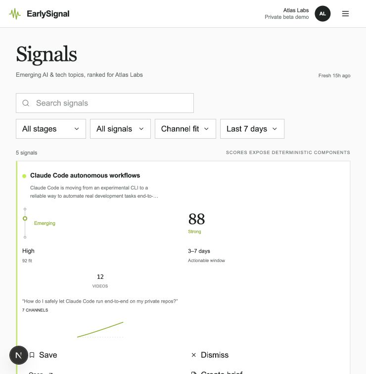
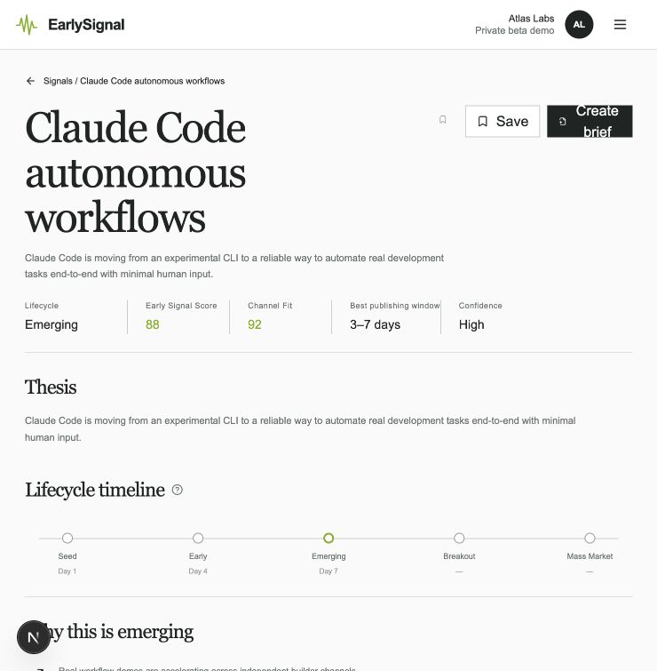
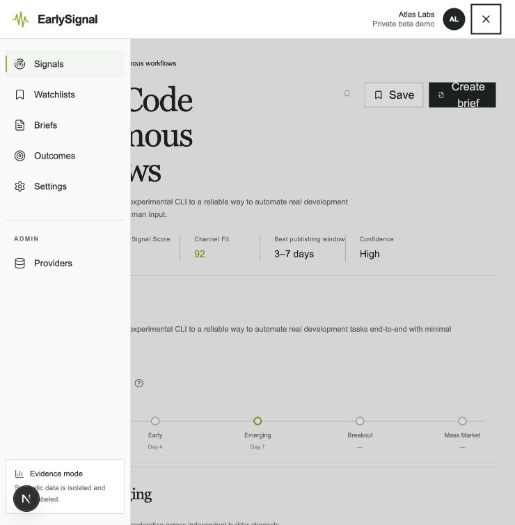
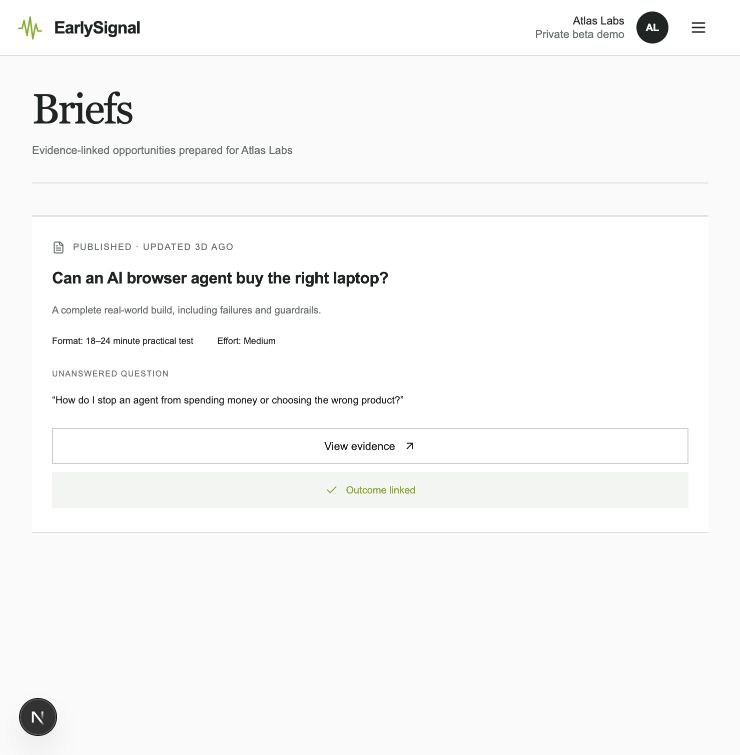
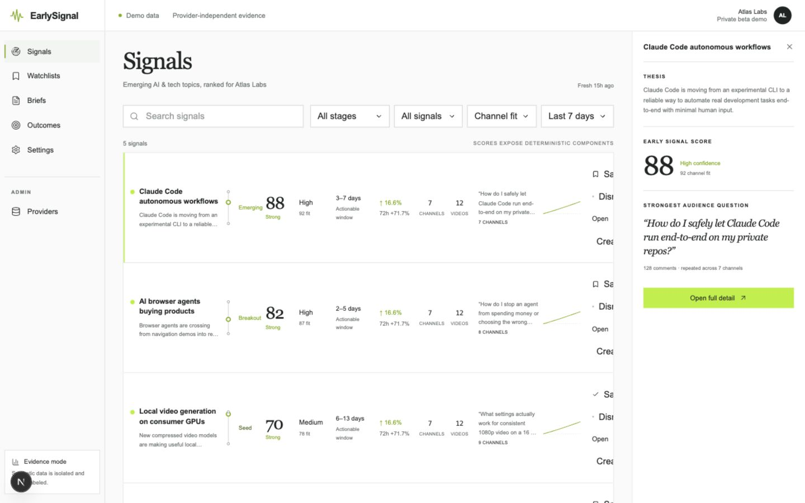
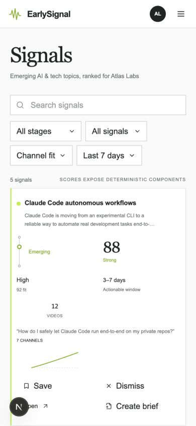

# EarlySignal UX audit — 2026-07-27

## Audit scope

Combined UX and screenshot-based accessibility audit of the core workflow:

1. Scan the Signals feed.
2. Open and evaluate one signal.
3. Use the compact navigation.
4. Continue to an evidence-linked brief.

Primary evidence was captured at the user's current 740 × 755 viewport.
Responsive probes were also captured at 390 × 844 and 1440 × 900.

## User goal

Quickly understand which topic is worth acting on, why it is credible, and what
to do next to turn the evidence into a publishable content brief.

## Overall verdict

The underlying evidence model is useful, but the interface currently exposes too
many unlabelled facts at once. Two responsive layout defects obscure actions, and
the product journey is expressed as several equally weighted controls instead of
one clear next step.

## Flow evidence

### 1. Scan Signals — poor

- The first card consumes most of the viewport and still clips the action area.
- Values such as `88`, `High`, `92 fit`, `3–7 days`, and `12 videos` are not
  paired with visible column labels, so users must infer their meaning.
- The score, lifecycle, audience question, sparkline, and four actions all
  compete at the same visual level.
- `Channel fit` and `Last 7 days` look like dropdown filters but have no
  implemented interaction.

### 2. Evaluate a signal — poor

- The title and action group share one rigid row. At this viewport the buttons
  shrink and `Create brief` wraps into a broken two-line control.
- The page starts with five metrics, a repeated thesis, a lifecycle diagram, and
  another explanation before the first evidence row. The decision-relevant
  evidence is pushed too far down.
- The 860 px evidence table relies on horizontal scrolling below this viewport,
  but there is no visible cue that it can be scrolled.

### 3. Navigate — fair

- The menu is readable and the current section is visible.
- `Admin → Providers` is mixed into the same navigation experience as the
  creator workflow, adding a technical destination that most users do not need.
- The evidence-mode note is useful but takes persistent space without helping
  the current decision.

### 4. Review a brief — fair

- The screen is calm and readable.
- It does not explain the brief's place in the workflow, what can be edited, or
  what action should happen after `Outcome linked`.
- A full-width `View evidence` control visually outweighs the brief itself.

## Responsive evidence

At 1440 px, the 310 px preview rail appears while the feed row still requires
more minimum width than the remaining content column. The action column is
clipped by the feed container.

The mobile layout does not overflow horizontally, but a single signal becomes a
very tall dashboard card. The lack of metric labels is more severe because the
desktop column structure has disappeared.

## Highest-impact changes

1. Replace the eleven-column signal row with a labelled decision card:
   topic and thesis, opportunity summary, evidence summary, then one primary
   `Review signal` action. Move Save, Dismiss, and Create brief to a compact
   secondary action menu.
2. Show the preview rail only when enough width remains (approximately 1600 px
   and above), or replace it with an intentional drawer that overlays rather
   than compresses the feed.
3. Stack the detail title and actions below 1024 px. Keep button labels on one
   line and give the title a real minimum-width constraint.
4. Put `Why act now?`, strongest audience question, and three decisive evidence
   items above the long lifecycle and provenance sections.
5. Implement `Channel fit` and date filtering or remove their dropdown
   affordances.
6. Raise functional text from 8–10 px to at least 12 px and strengthen muted
   contrast.
7. Make the journey explicit: `Review → Save or Brief → Publish → Track outcome`.

## Accessibility risks

- Much of the functional copy is 8–10 px and uses low-contrast muted colors.
- The full-card transparent selection button has no visible label and competes
  with the visible actions for keyboard focus.
- Several icon-only controls rely on accessible names but have small visible
  targets.
- Screenshot evidence cannot confirm keyboard order, screen-reader
  announcements, zoom behavior, or WCAG contrast ratios; those require separate
  automated and manual testing.

## Recommended next implementation slice

First stabilize the feed and signal-detail header at 390, 740, 1024, and 1440 px.
Then simplify the information architecture around a single `Review signal`
decision path. Only after that should the remaining admin and outcome screens be
polished.
